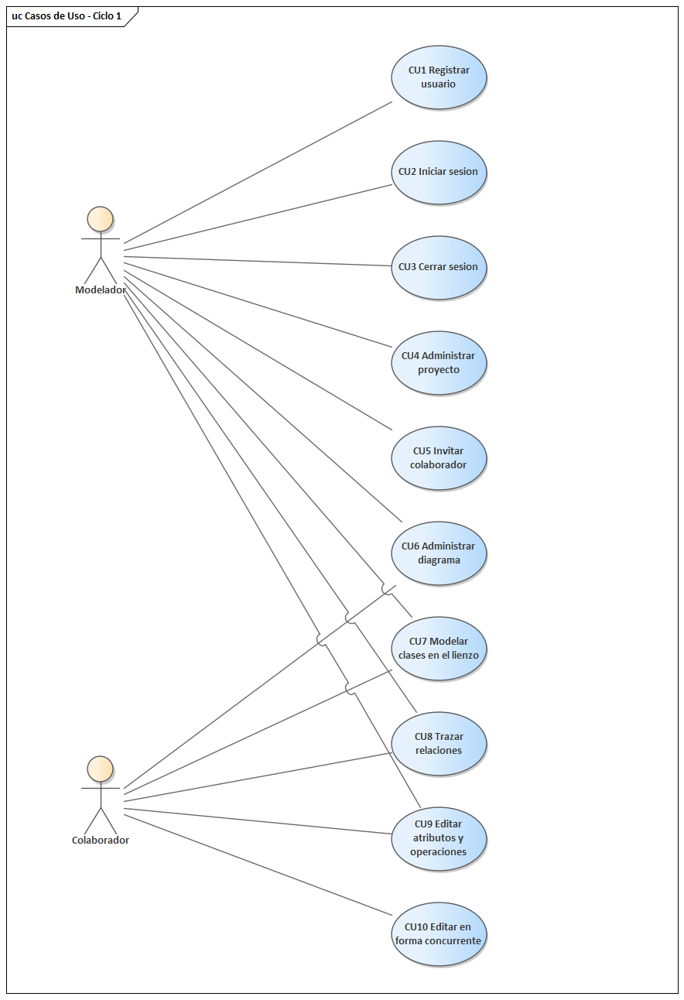
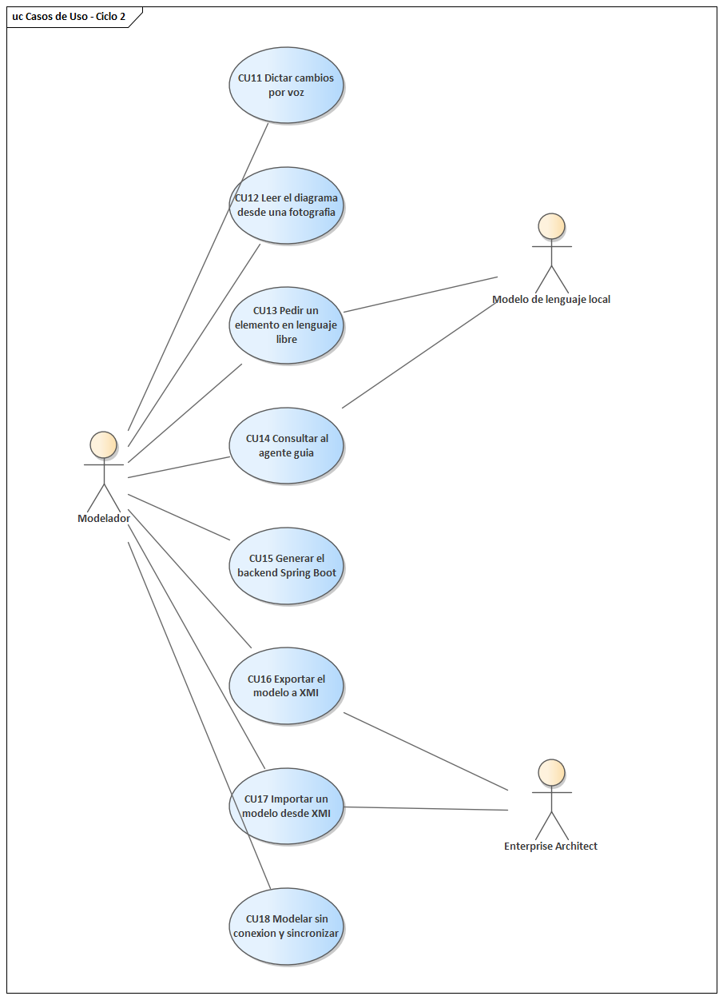
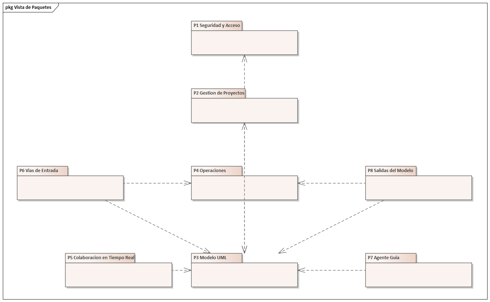
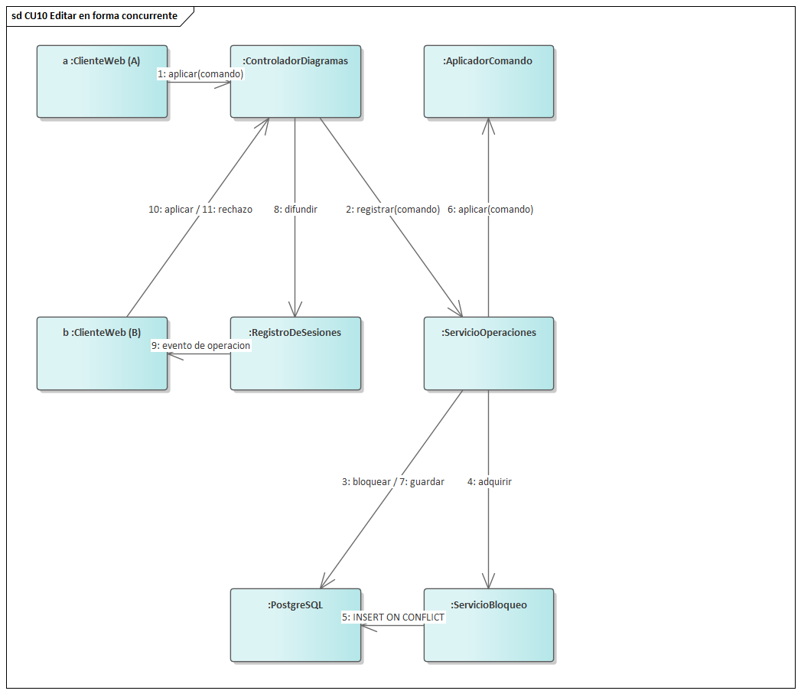
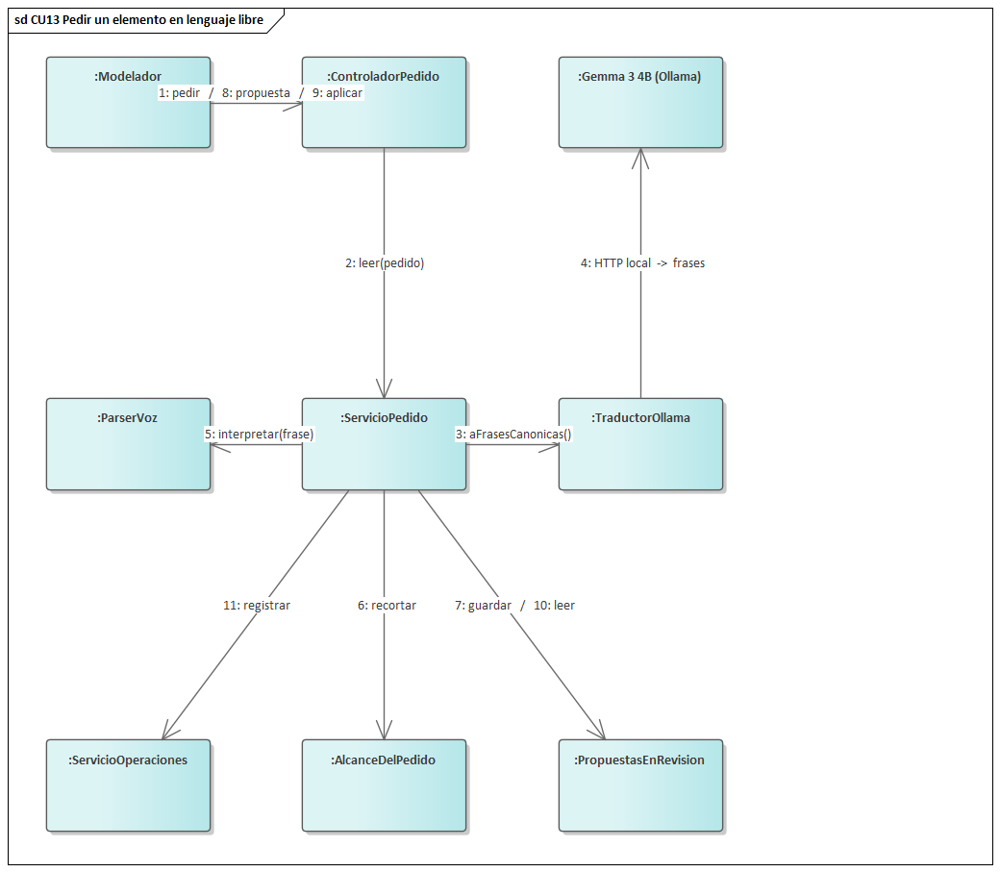
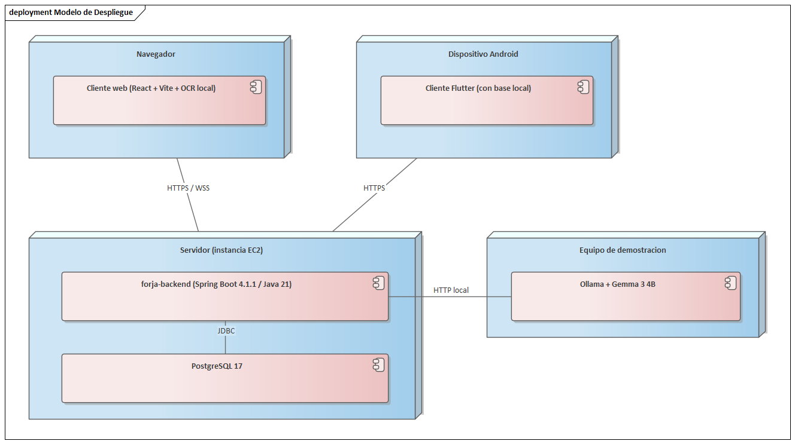
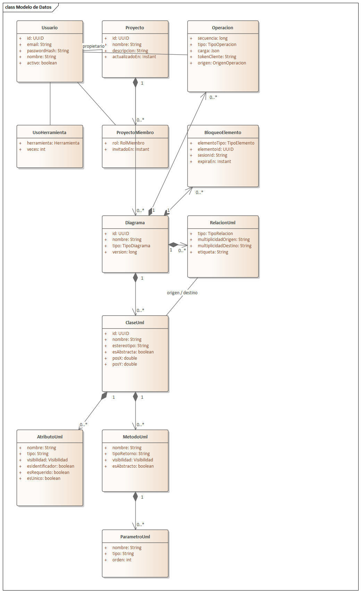

# UNIVERSIDAD GABRIEL RENÉ MORENO
## FACULTAD DE CIENCIAS DE LA COMPUTACIÓN

# PARCIAL - 1

## FORJA: HERRAMIENTA CASE COLABORATIVA PARA LA FASE DE DISEÑO, CON DICTADO POR VOZ, LECTURA DE PIZARRA, GENERACIÓN DE BACKEND SPRING BOOT E INTERCAMBIO XMI CON ENTERPRISE ARCHITECT

**ESTUDIANTE:**

| Nombre | Registro |
|---|---|
| ARTEAGA SILVA GEIMBERT SANTIAGO | 223041688 |

**DOCENTE:** M.Sc. MARTÍNEZ CANEDO ROLANDO ANTONIO

**MATERIA:** INGENIERÍA DE SOFTWARE 1

SANTA CRUZ - BOLIVIA

---

# TABLA DE CONTENIDO

**1) Perfil**
- 1.1 Introducción
- 1.2 Objetivo General
- 1.3 Objetivos Específicos
- 1.4 Descripción del problema
- 1.5 Alcance

**Parte I — Fundamentación Teórica**
- 1.1.1 Ingeniería de Software Asistida por Computadora (CASE)
- 1.1.2 Desarrollo de Software basado en Componentes
- 1.1.3 Ingeniería Humana (Experiencia del Usuario)
- 1.1.4 Inteligencia Artificial aplicada al desarrollo de software
- 1.1.5 El Proceso Unificado de Desarrollo de Software (PUDS)
- 1.1.6 UML 2.5.1
- 1.1.7 Spring Boot

**Parte II — Proceso de desarrollo**
- 2.1) Flujo de Trabajo: Captura de Requisitos
  - 2.1.1 Actores
  - 2.1.2 Casos de uso
  - 2.1.3 Priorizar casos de uso
  - 2.1.4 Detallar casos de uso
  - 2.1.5 Estructura del modelo de casos de uso
- 2.2) Flujo de Trabajo: Análisis
  - 2.2.1 Identificar paquetes
  - 2.2.2 Relacionar paquetes y casos de uso
  - 2.2.3 Vista de paquetes
  - 2.2.4 Análisis de casos de uso
  - 2.2.5 Análisis de paquetes
- 2.3) Flujo de Trabajo: Diseño
  - 2.3.1 Diseño de arquitectura
  - 2.3.1.1 Diseño físico — Modelo de despliegue
  - 2.3.2 Diseño de datos
  - 2.3.2.1 Diseño lógico y mapeo
  - 2.3.2.2 Diseño físico — Tabla de volumen
- 2.4) Flujo de Trabajo: Implementación
- 2.5) Flujo de Trabajo: Pruebas

**Bibliografía**

**Anexo**

**Índice de figuras**

| # | Figura | Sección |
|---|---|---|
| 1 | Casos de uso del Ciclo #1 | 2.1.5 |
| 2 | Casos de uso del Ciclo #2 | 2.1.5 |
| 3 | Vista de paquetes | 2.2.3 |
| 4 | Comunicación — CU10, editar en forma concurrente | 2.2.4 |
| 5 | Comunicación — CU13, pedir un elemento en lenguaje libre | 2.2.4 |
| 6 | Modelo de despliegue | 2.3.1.1 |
| 7 | Modelo de datos (diagrama de clases) | 2.3.2.1 |
| 8 | Código QR del repositorio | Anexo A |
| 9 | Código QR de la aplicación desplegada | Anexo B |

Las siete primeras figuras se construyeron en **Enterprise Architect 17.2**
mediante automatización COM; el guion que las genera queda en el repositorio.
Las dos últimas son códigos QR generados por guion y verificados
decodificándolos.

---

# 1) Perfil

## 1.1 Introducción

El diseño de un sistema rara vez nace en una herramienta de modelado. Nace en una
pizarra, entre varias personas, en lenguaje natural y a mano alzada. Lo que queda
de esa reunión es una fotografía que alguien debe transcribir después a un
diagrama formal, y ese diagrama a código. Cada transcripción es una oportunidad de
perder información y de que se separen tres cosas que deberían coincidir: lo que
el equipo decidió, lo que quedó documentado y lo que finalmente se programó.

Las herramientas CASE actuales resuelven bien el tramo central de ese recorrido
—permiten dibujar el modelo y algunas generan código— pero dejan los dos extremos
afuera. No recogen lo que se dijo ni lo que se dibujó a mano, y su trabajo
colaborativo es limitado: en la práctica una persona modela y las demás miran.

FORJA aborda el recorrido completo. Es una herramienta CASE colaborativa que
permite que varias personas construyan el mismo diagrama de clases UML al mismo
tiempo, por tres vías distintas —dibujándolo, dictándolo en castellano o
fotografiando una pizarra— y que conecta ese modelo con su implementación: genera
un proyecto Spring Boot ejecutable e intercambia el modelo con Enterprise
Architect mediante XMI 2.5.1, en los dos sentidos.

El recorrido no termina en el código generado. La aplicación móvil de FORJA es
además el frontend de ese backend: deriva del mismo diagrama, en tiempo de
ejecución, una pantalla por cada clase, de modo que lo que se dibujó en la
pizarra por la mañana puede estar cargando datos reales desde un teléfono por la
tarde, sin haber escrito una línea de interfaz. Es el tramo que cierra el
argumento de la herramienta: el modelo no es documentación de algo que después se
programa, es la fuente de la que salen el servicio y la pantalla.

El sistema incorpora además un agente guía embebido que observa el uso de la
herramienta y el estado del modelo para enseñar a usarla y señalar problemas de
diseño antes de que lleguen al código generado.

## 1.2 Objetivo General

Desarrollar una herramienta CASE colaborativa que permita construir diagramas de
clases UML entre varias personas en tiempo real —mediante edición gráfica,
dictado por voz y reconocimiento de fotografías de pizarra—, generar
automáticamente a partir de ellos un backend Spring Boot ejecutable e
intercambiar el modelo con Enterprise Architect a través de XMI 2.5.1.

## 1.3 Objetivos Específicos

- Implementar un sistema de autenticación sin estado que permita registrar
  usuarios, iniciar y cerrar sesión, y trabajar desde el cliente web y el cliente
  móvil con la misma credencial.
- Desarrollar la gestión de proyectos y diagramas, con invitación de
  colaboradores por correo y permisos otorgados a nivel de proyecto.
- Construir un lienzo de edición gráfica de diagramas de clases con la notación
  UML 2.5.1 correcta.
- Garantizar la edición concurrente del mismo diagrama por varias personas
  mediante exclusión mutua sobre cada elemento y sincronización en tiempo real.
- Implementar el dictado por voz mediante una gramática determinista en
  castellano que convierta frases en operaciones del modelo.
- Integrar el reconocimiento de fotografías de pizarra para incorporar al modelo
  un diagrama dibujado a mano.
- Incorporar un modelo de lenguaje local que traduzca a operaciones válidas un
  pedido dicho de cualquier manera, acotado a un elemento por vez y con revisión
  previa antes de aplicarlo.
- Desarrollar un agente guía basado en reglas que observe el modelo y el uso de
  la herramienta para enseñar a usarla y advertir problemas de diseño.
- Generar automáticamente, a partir del modelo, un proyecto Spring Boot de cuatro
  capas que compile.
- Implementar la exportación e importación de modelos en XMI 2.5.1 compatible con
  Enterprise Architect.
- Desarrollar un cliente móvil Android que modele sin conexión y que además
  sea el frontend del backend generado, derivando sus pantallas del propio
  diagrama en tiempo de ejecución, con dictado por voz sobre los campos del
  formulario y un modelo de lenguaje en el aparato que propone —y nunca
  aplica— cuando las reglas no alcanzan.
- Desplegar la herramienta en una instancia de nube servida por HTTPS, de modo
  que el navegador y el teléfono la alcancen desde cualquier red.

## 1.4 Descripción del problema

El trabajo de diseño de software presenta hoy cuatro problemas concretos:

**La transcripción manual pierde información.** Entre la pizarra y la herramienta
de modelado hay una persona copiando, y entre la herramienta y el código hay otra
escribiendo. Cada paso introduce diferencias que nadie vuelve a revisar.

**El modelado es individual aunque el diseño sea colectivo.** Las herramientas
tradicionales operan sobre un archivo. Dos personas no pueden editarlo a la vez
sin que una sobrescriba a la otra, de modo que el diseño lo discute el equipo
pero lo transcribe una sola persona.

**La entrada es exclusivamente gráfica.** Para agregar una clase hay que
dibujarla, aunque decir «Paciente tiene muchas Consultas» sea más rápido y más
cercano a cómo se discute un modelo.

**Los errores de diseño se descubren tarde.** Una clase sin atributos, una
interfaz con atributos o una jerarquía con atributos repetidos son problemas que
la herramienta podría señalar en el momento, pero que habitualmente se descubren
cuando el código ya está escrito.

## 1.5 Alcance

**Módulo de Gestión de Usuarios.** Registro, inicio y cierre de sesión mediante
credenciales propias con contraseña cifrada. La sesión es sin estado, lo que
permite que el cliente móvil trabaje sin conexión sin depender de una sesión
viva en el servidor.

**Módulo de Gestión de Proyectos y Diagramas.** Creación de proyectos, creación
de diagramas dentro de un proyecto, e invitación de colaboradores por correo. Los
permisos se otorgan por proyecto y no por diagrama.

**Módulo de Edición Gráfica.** Lienzo con notación UML 2.5.1: clases con
atributos y operaciones, visibilidades, clases abstractas, interfaces, y los seis
tipos de relación con sus multiplicidades.

**Módulo de Edición Colaborativa.** Varias personas sobre el mismo diagrama en
tiempo real, con exclusión mutua sobre cada elemento arbitrada por la base de
datos y difusión inmediata de los cambios aceptados.

**Módulo de Dictado por Voz.** Gramática determinista en castellano que convierte
frases habladas o escritas en operaciones del modelo: sobre el diagrama en el
cliente web, y sobre los campos de un formulario en el cliente móvil. La
gramática no necesita conexión; el reconocedor que la alimenta es el de Android
y sí la necesita mientras el aparato no tenga descargado el paquete de español.

**Módulo de Lectura de Pizarra.** Reconocimiento óptico de una fotografía de un
diagrama dibujado a mano, ejecutado en el propio navegador.

**Módulo de Inteligencia Artificial Generativa.** Modelo de lenguaje local que
traduce a operaciones del modelo un pedido dicho de cualquier manera. Su alcance
está limitado a un elemento por vez y su propuesta pasa por una revisión previa
obligatoria antes de aplicarse.

**Módulo de Agente Guía.** Sistema experto de reglas que observa el modelo y el
uso de la herramienta, enseña a usarla y advierte problemas de diseño.

**Módulo de Generación de Backend.** Producción automática de un proyecto Spring
Boot con cuatro capas por cada clase concreta del modelo.

**Módulo de Intercambio XMI.** Exportación e importación de modelos en XMI 2.5.1
compatible con Enterprise Architect, preservando la disposición del diagrama.

**Módulo Móvil.** Cliente Android con dos papeles. Como cliente de FORJA permite
modelar sin conexión, encolando las operaciones y sincronizándolas al recuperar
la red. Como **frontend del backend generado** deriva del propio diagrama, en
tiempo de ejecución, una lista y un formulario por cada clase, de modo que la
misma aplicación instalada sirve para cualquier modelo sin recompilarla; los
registros se cargan sin conexión y se encolan hasta que el backend generado esté
al alcance, y se pueden dictar campo por campo.

**Módulo de Despliegue.** La herramienta corre en una instancia de nube junto a
su base de datos, empaquetada en una imagen de contenedor, y se sirve por HTTPS
a través de una distribución de red de entrega de contenido.

### Fuera del alcance

- Otros diagramas UML: solo se modela el diagrama de clases.
- Generación del cliente frontend: se genera el backend, no la interfaz. Que el
  cliente móvil derive sus pantallas del diagrama es otra cosa y no debe
  confundirse con esto: no se emite código de interfaz en ninguna parte.
- Ingeniería inversa desde código existente hacia el modelo.
- Despliegue del backend generado: se genera y se levanta en el equipo de quien
  demuestra, no en la nube.
- Autenticación del backend generado: lo que FORJA emite no la tiene, y el
  cliente no puede aportar lo que el servidor no pide.

---

# Parte I — Fundamentación Teórica

## 1.1.1 Ingeniería de Software Asistida por Computadora (CASE)

*Computer-Aided Software Engineering* designa al conjunto de herramientas que
asisten las actividades del proceso de desarrollo de software. La clasificación
habitual las ordena según la fase que cubren:

- **Upper-CASE**: asisten las fases tempranas —análisis y diseño—. Modelado,
  diagramación, especificación de requisitos.
- **Lower-CASE**: asisten la construcción y el mantenimiento. Generación de
  código, ingeniería inversa, pruebas.
- **I-CASE** *(integrated)*: cubren el ciclo completo sobre un repositorio común.

**FORJA es una herramienta upper-CASE que cruza deliberadamente hacia
lower-CASE.** Su objeto de trabajo es el modelo de diseño, pero no se detiene
ahí: genera la estructura de la implementación. Esa frontera es precisamente
donde ocurre la pérdida de información que el proyecto busca eliminar.

Las capacidades que caracterizan a una herramienta CASE, y cómo las cumple FORJA:

| Capacidad | En FORJA |
|---|---|
| Repositorio central del modelo | PostgreSQL; el modelo no vive en archivos sueltos |
| Edición gráfica del modelo | Lienzo SVG con notación UML 2.5.1 |
| Verificación de consistencia | Agente de reglas que detecta problemas del modelo |
| Generación de código | Proyecto Spring Boot de cuatro capas por clase |
| Intercambio con otras herramientas | XMI 2.5.1, en los dos sentidos |
| Trabajo en equipo | Exclusión mutua y sincronización en tiempo real |
| Trazabilidad | Bitácora de operaciones con su origen |

## 1.1.2 Desarrollo de Software basado en Componentes

El desarrollo basado en componentes propone construir sistemas ensamblando
unidades de software con interfaces bien definidas, reemplazables y
reutilizables, en lugar de escribir cada sistema desde cero. Szyperski define un
componente como una unidad de composición con interfaces especificadas
contractualmente y dependencias explícitas de contexto, desplegable de forma
independiente.

Este proyecto **reutiliza componentes y produce componentes**, y conviene
distinguir las dos cosas.

### Componentes que FORJA reutiliza

| Componente | Función que aporta |
|---|---|
| Spring Boot 4.1.1 | Contenedor, inyección de dependencias, servidor web |
| Spring Security + Nimbus | Firma y validación de credenciales JWT |
| Hibernate / JPA | Mapeo objeto-relacional |
| Flyway | Versionado reproducible del esquema de la base |
| PostgreSQL 17 | Persistencia y arbitraje de la concurrencia |
| React 19 + Vite | Cliente web |
| Gemini (modelo de visión) | Lectura de la fotografía de un diagrama |
| Flutter | Cliente móvil Android |
| Ollama + Gemma 3 4B | Ejecución del modelo de lenguaje en el equipo |
| flutter_gemma + Gemma 3 1B | Ejecución del modelo de lenguaje dentro del teléfono |
| Docker y Docker Compose | Empaquetado y puesta en marcha del despliegue |

La criptografía, el mapeo objeto-relacional y la lectura de imágenes no se
implementaron: son problemas resueltos, y reescribirlos habría consumido el
tiempo que el proyecto necesitaba para lo que sí es propio.

### Componentes que FORJA produce

El generador no emite un archivo suelto: produce un **proyecto ensamblado por
componentes**, con cuatro capas por cada clase concreta del modelo.

```
Clase «Paciente» del modelo
        │
        ├── dominio/Paciente.java              entidad JPA
        ├── repositorio/PacienteRepositorio    acceso a datos
        ├── servicio/PacienteServicio          lógica de negocio
        └── web/PacienteControlador            interfaz REST
```

Cada capa depende únicamente de la inmediatamente inferior, y esa dependencia se
declara por constructor. El resultado compila y se ejecuta, y sus piezas pueden
sustituirse individualmente: es un ensamblado de componentes, no un volcado de
texto.

Hay una quinta capa que el generador **no** emite y que conviene nombrar aquí,
porque es la que explica una decisión de diseño del cliente móvil: la interfaz de
usuario. El teléfono no recibe pantallas generadas; las deriva del mismo diagrama
en tiempo de ejecución, de modo que la misma aplicación instalada sirve para
cualquier modelo. Es la diferencia entre reutilizar un componente —una aplicación
escrita una vez, parametrizada por el diagrama— y generar uno nuevo por cada
modelo, y se optó por lo primero (2.4.6).

### El mantenimiento del software

El desarrollo basado en componentes se justifica en buena medida por su efecto
sobre el mantenimiento, que es la fase más larga y costosa del ciclo de vida. Se
distinguen cuatro tipos:

**Mantenimiento correctivo.** Corrige defectos detectados después de la entrega.
En este proyecto puede ejemplificarse con los defectos hallados al usar la
herramienta el 20 de septiembre: el paso de revisión del pedido no ataba, el
agente devolvía error al consultarlo, y la importación XMI perdía la disposición
del diagrama. Los tres se corrigieron con una prueba que los reproduce primero.

**Mantenimiento adaptativo.** Ajusta el sistema a cambios de su entorno. El caso
del proyecto es el traductor de lenguaje natural: se diseñó inicialmente para
ejecutarse dentro del cliente móvil y se adaptó a un servicio local invocado
desde el servidor cuando la medición mostró que el modelo pequeño no daba, en el
navegador, resultados utilizables. Más tarde el teléfono recibió su propio
modelo, mucho más chico, en el único lugar donde equivocarse sale barato: como
tercer escalón del dictado, proponiendo una frase que las reglas vuelven a
interpretar. La misma pieza cambió dos veces de lugar sin cambiar de contrato.

**Mantenimiento preventivo.** Modifica el sistema para evitar fallos futuros. El
ejemplo del proyecto es la separación de la base de datos de pruebas: la suite
vaciaba las tablas de la base de desarrollo, y aunque eso no era un defecto del
producto, garantizaba una pérdida de datos futura.

**Mantenimiento perfectivo.** Mejora características existentes sin corregir un
fallo. El rediseño de la interfaz y la ampliación del agente guía para que
responda consultando el estado real pertenecen a esta categoría.

## 1.1.3 Ingeniería Humana (Experiencia del Usuario)

La ingeniería humana estudia cómo debe comportarse un sistema para que las
personas puedan usarlo sin esfuerzo innecesario. En una herramienta CASE el
problema es particular: quien la usa está concentrado en un problema de diseño, y
toda atención que la herramienta le exija para sí misma es atención que se resta
del modelo.

Las decisiones de este proyecto en esa dirección:

**Una sola superficie clara, y es el modelo.** Toda la aplicación es oscura salvo
el diagrama, que se presenta como una hoja de papel de ingeniería. La metáfora es
explícita —la aplicación es la mesa de dibujo y el diagrama es la hoja apoyada
encima— y de ella se desprende el resto: los instrumentos no compiten con el
contenido.

**El color solo se usa cuando significa algo.** Hay exactamente dos colores con
significado: uno indica que un elemento está vivo, es propio o está seleccionado;
el otro, que otra persona lo tiene tomado. Un tercer color decorativo destruiría
la utilidad de los dos primeros.

**Los errores no dejan a la persona detenida.** El agente guía no falla ante
ninguna entrada; el pedido al modelo de lenguaje degrada a una respuesta vacía en
lugar de a un error; una credencial que dejó de ser válida devuelve a la pantalla
de ingreso en vez de mostrar un mensaje técnico.

**Lo que el modelo propone se revisa antes de aplicarse.** Un modelo de lenguaje
de tamaño reducido se equivoca, de modo que su propuesta se muestra y una persona
decide. Esta decisión es a la vez de experiencia de usuario y de arquitectura.

**La herramienta asiste al modelado; no modela.** El pedido en lenguaje libre está
limitado a un elemento por vez —una clase con sus miembros, o una relación—, de
modo que la decisión de qué contiene el modelo siga siendo de quien modela. Lo que
el modelo de lenguaje aporta no es capacidad de diseño sino tolerancia a cómo se
diga la instrucción, que es exactamente lo que una gramática determinista no puede
dar. **El límite se implementa en el código y no en el texto que se le envía al
modelo**, porque se midió que el modelo desobedece sus instrucciones en la mayoría
de las ejecuciones: una restricción que solo vive en el prompt no es una
restricción, y el recorte se aplica antes de mostrar la propuesta para que lo
revisado coincida con lo que se aplica.

**Nada se marca como hecho sin evidencia.** El recorrido de aprendizaje que
presenta el agente no avanza por haber visitado una pantalla, sino por haber
realizado la acción, verificada contra la bitácora.

## 1.1.4 Inteligencia Artificial aplicada al desarrollo de software

La disciplina distingue dos grandes paradigmas:

**IA simbólica.** El conocimiento se representa explícitamente como hechos y
reglas, y un motor de inferencia deriva conclusiones. Es el paradigma de los
sistemas expertos. Su propiedad característica es que las conclusiones son
auditables y reproducibles: puede señalarse qué regla se aplicó.

**IA sub-simbólica o conexionista.** El conocimiento está distribuido en los
parámetros de un modelo entrenado sobre datos. Es el paradigma de las redes
neuronales y de los modelos de lenguaje. Su propiedad característica es la
capacidad de generalizar a entradas no previstas; su contrapartida, que la misma
entrada puede producir salidas distintas y no hay una regla que exhibir.

**FORJA implementa los dos, deliberadamente separados según lo que cada uno hace
bien.**

| Paradigma | Dónde | Para qué |
|---|---|---|
| Simbólico | Agente guía: 24 reglas y 17 respuestas escritas | Razonar sobre el modelo y enseñar la herramienta |
| Simbólico | Gramática determinista del dictado, en el navegador y en el teléfono | Convertir una frase en una operación |
| Generativo | Traducción de lenguaje libre a operaciones, de a un elemento | Entender lo que una persona escribe o dice |

El paradigma generativo aparece en dos lugares y en los dos con la misma forma:
en el cliente web, consultando a Gemma 3 4B por Ollama desde el servidor, y en el
cliente móvil, con Gemma 3 1B corriendo dentro del aparato. Cambia el tamaño del
modelo y cambia dónde se ejecuta; no cambia la regla de que **el modelo propone
una frase y la gramática determinista es lo único que escribe**.

El criterio que ordena la separación es que **las reglas mandan, y el modelo
generativo interviene únicamente donde las reglas no llegan.** Para saber que una
interfaz no puede declarar atributos no hace falta inferir nada: hace falta
conocer la regla. Un modelo de lenguaje lo diría correctamente casi siempre, y
ese «casi» no es defendible en una herramienta cuya función es enseñar.

La decisión se sustenta en una medición y no en una preferencia. Consultado el
mismo pedido varias veces con el parámetro de temperatura en cero, Gemma 3 4B
produce propuestas distintas en cada ejecución. Por eso el modelo **propone y una
persona revisa**, y por eso lo que la herramienta debe afirmar con certeza lo
afirman las reglas.

> Conviene precisar dos puntos que suelen confundirse. **El generador de código no
> utiliza inteligencia artificial**: es un traductor determinista con reglas de
> mapeo, y esa es su virtud, porque el proyecto generado compila siempre y es
> reproducible. **El reconocimiento de voz tampoco**: la conversión de voz a texto
> la realiza el navegador o el sistema Android. Lo que FORJA implementa es la
> conversión de texto a operaciones del modelo.

## 1.1.5 El Proceso Unificado de Desarrollo de Software (PUDS)

El Proceso Unificado fue formulado por Jacobson, Booch y Rumbaugh —los mismos
autores que unificaron UML— y se define por tres características:

**Dirigido por casos de uso.** Los requisitos se expresan como interacciones
observables entre actores y el sistema, y esos casos guían el diseño, la
implementación y las pruebas.

**Centrado en la arquitectura.** La arquitectura se establece temprano, en una
versión ejecutable y reducida, atacando primero los riesgos técnicos mayores.

**Iterativo e incremental.** El desarrollo avanza en iteraciones que producen
incrementos ejecutables del producto, no documentos intermedios.

El proceso organiza el trabajo en cuatro fases —Inicio, Elaboración,
Construcción y Transición— y en cinco flujos de trabajo que atraviesan todas las
fases en proporciones distintas: captura de requisitos, análisis, diseño,
implementación y pruebas. La Parte II de este documento sigue esos flujos.

## 1.1.6 UML 2.5.1

UML nació de la unificación de tres métodos de modelado orientado a objetos
desarrollados de forma independiente a finales de los años ochenta: el método de
**Grady Booch**, la *Object Modeling Technique* de **James Rumbaugh**, y
*Objectory* / OOSE de **Ivar Jacobson**. La unificación se formalizó en Rational
Software y el resultado fue adoptado por el *Object Management Group* (OMG) como
estándar en 1997. La versión vigente es **UML 2.5.1** (OMG, diciembre de 2017), y
es la que FORJA implementa.

El **diagrama de clases** es el diagrama estructural central del lenguaje:
describe los tipos del sistema, sus características y las relaciones entre ellos.
Los elementos que FORJA modela:

| Elemento UML | Representación |
|---|---|
| Clase | Rectángulo con tres compartimentos: nombre, atributos, operaciones |
| Clase abstracta | Nombre en cursiva |
| Interfaz | Estereotipo `«interface»` |
| Atributo | `visibilidad nombre: Tipo` |
| Operación | `visibilidad nombre(parámetros): TipoRetorno` |
| Visibilidad | `+` público, `-` privado, `#` protegido, `~` paquete |
| Asociación | Línea con multiplicidades en ambos extremos |
| Agregación | Rombo hueco en el extremo del todo |
| Composición | Rombo lleno en el extremo del todo |
| Generalización | Triángulo hueco apuntando a la superclase |
| Realización | Triángulo hueco con línea discontinua |
| Dependencia | Flecha abierta con línea discontinua |
| Multiplicidad | `1`, `0..1`, `0..*`, `1..*`, `n..m` |

La distinción entre **agregación y composición** merece mención porque es la que
más consecuencias tiene en el código generado: la composición implica que la parte
no existe sin el todo, y el generador la traduce con borrado en cascada
(`cascade = CascadeType.ALL, orphanRemoval = true`), mientras que la agregación no
lo hace.

### XMI: el intercambio entre herramientas

*XML Metadata Interchange* es el estándar del OMG para serializar modelos
conformes a MOF —y por lo tanto modelos UML— en XML. Su propósito es que un
modelo construido en una herramienta pueda abrirse en otra sin pérdida.

El intercambio real presenta dos dificultades que el estándar no resuelve, y que
este proyecto tuvo que atender:

**El estándar admite varias formas de expresar lo mismo.** El tipo de un atributo
puede venir como referencia `href` a la biblioteca de tipos primitivos, como
`xmi:idref` a un tipo declarado en el documento, o como atributo `type` directo.
Las herramientas usan las tres; el importador de FORJA acepta las tres.

**La disposición visual viaja fuera del modelo.** XMI serializa el modelo, no el
dibujo. Enterprise Architect deposita la geometría en un bloque de extensión
propio con la posición de cada elemento. Una herramienta que ignore ese bloque
importa el modelo correcto pero con todas las clases amontonadas.

## 1.1.7 Spring Boot

Spring Boot es una extensión del framework Spring orientada a reducir la
configuración necesaria para poner en marcha una aplicación. Se apoya en tres
mecanismos:

**Inversión de control e inyección de dependencias.** Los objetos no construyen
sus colaboradores: los reciben, y el contenedor resuelve el grafo de
dependencias. La consecuencia práctica, y la que importa para este proyecto, es
que cada pieza puede probarse sustituyendo sus colaboradores por dobles de
prueba.

**Autoconfiguración.** El framework inspecciona el *classpath* y configura lo que
encuentra, permitiendo sobrescribir cualquier decisión.

**Starters.** Agrupaciones de dependencias coherentes entre sí. FORJA utiliza los
de `web`, `data-jpa`, `security`, `oauth2-resource-server`, `websocket`,
`validation` y `flyway`.

La versión utilizada es **Spring Boot 4.1.1 sobre Java 21**, y es además la
tecnología que el generador de código produce.

---

# Parte II — Proceso de desarrollo

## 2.1) Flujo de Trabajo: Captura de Requisitos

### 2.1.1 Actores

**A1. Modelador.** Persona que crea proyectos y diagramas y trabaja sobre su
propio modelo. Es el actor iniciador de la mayoría de los casos de uso: construye
el modelo por cualquiera de las tres vías, invita colaboradores, genera el
backend e intercambia con Enterprise Architect.

**A2. Colaborador.** Persona invitada a un proyecto ajeno con rol de editor.
Puede modelar sobre los diagramas de ese proyecto, pero no invitar a terceros ni
administrar el proyecto. Existe porque el trabajo simultáneo es el núcleo del
sistema.

**A3. Enterprise Architect** *(actor secundario, sistema externo)*. Herramienta
CASE con la que se intercambian modelos mediante documentos XMI 2.5.1. No inicia
casos de uso: participa como origen o destino del intercambio.

**A4. Modelo de lenguaje local** *(actor secundario, sistema externo)*. Servicio
Ollama que ejecuta Gemma 3 en el equipo. Es consultado para traducir lenguaje
libre a operaciones y para responder preguntas que la base de reglas no cubre. Su
ausencia no impide operar el sistema.

**A5. Backend generado** *(actor secundario, sistema externo)*. El proyecto
Spring Boot que la propia herramienta produce y que alguien levanta. No inicia
casos de uso: recibe los registros que se cargan desde el cliente móvil. Es un
actor secundario y no un componente de FORJA, y la distinción importa: FORJA lo
escribe, pero una vez escrito es un sistema aparte, con su propia base de datos y
su propio ciclo de vida.

**A6. Operador de datos.** Persona que usa el cliente móvil para cargar registros
contra el backend generado. No modela: consume la aplicación que salió del
modelo. Se distingue del Modelador porque su trabajo empieza donde termina el de
aquel, y porque es el actor que justifica que la herramienta genere código
ejecutable y no solo documentación.

### 2.1.2 Casos de uso

| ID | Caso de uso |
|---|---|
| CU1 | Registrar usuario |
| CU2 | Iniciar sesión |
| CU3 | Cerrar sesión |
| CU4 | Administrar proyecto |
| CU5 | Invitar colaborador |
| CU6 | Administrar diagrama |
| CU7 | Modelar clases en el lienzo |
| CU8 | Trazar relaciones |
| CU9 | Editar atributos y operaciones |
| CU10 | Editar en forma concurrente |
| CU11 | Dictar cambios por voz |
| CU12 | Leer el diagrama desde una fotografía de pizarra |
| CU13 | Pedir un elemento en lenguaje libre |
| CU14 | Consultar al agente guía |
| CU15 | Generar el backend Spring Boot |
| CU16 | Exportar el modelo a XMI |
| CU17 | Importar un modelo desde XMI |
| CU18 | Modelar sin conexión y sincronizar |
| CU19 | Cargar registros en el backend generado desde el teléfono |

### 2.1.3 Priorizar casos de uso

La priorización siguió el principio del PUDS de atacar primero el riesgo
arquitectónico mayor. En este sistema ese riesgo no era la interfaz ni la
generación de código, sino **la edición concurrente del mismo modelo**: un error
allí no se corrige localmente, obliga a rediseñar.

#### Ciclo #1 — Arquitectura ejecutable y riesgo mayor

| ID | Caso de Uso | Estado | Prioridad | Riesgo | Actor |
|---|---|---|---|---|---|
| CU1 | Registrar usuario | Aprobado | Alta | Bajo | Modelador |
| CU2 | Iniciar sesión | Aprobado | Alta | Medio | Modelador |
| CU3 | Cerrar sesión | Aprobado | Normal | Bajo | Modelador |
| CU4 | Administrar proyecto | Aprobado | Alta | Bajo | Modelador |
| CU5 | Invitar colaborador | Aprobado | Alta | Medio | Modelador |
| CU6 | Administrar diagrama | Aprobado | Alta | Bajo | Modelador |
| CU7 | Modelar clases en el lienzo | Aprobado | Alta | Medio | Modelador |
| CU8 | Trazar relaciones | Aprobado | Alta | Medio | Modelador |
| CU9 | Editar atributos y operaciones | Aprobado | Alta | Bajo | Modelador |
| CU10 | Editar en forma concurrente | Aprobado | Alta | **Alto** | Colaborador |

#### Ciclo #2 — Vías alternativas de entrada y salidas del modelo

| ID | Caso de Uso | Estado | Prioridad | Riesgo | Actor |
|---|---|---|---|---|---|
| CU11 | Dictar cambios por voz | Aprobado | Alta | Medio | Modelador |
| CU12 | Leer el diagrama desde una fotografía | Aprobado | Normal | Alto | Modelador |
| CU13 | Pedir un elemento en lenguaje libre | Aprobado | Normal | **Alto** | Modelador |
| CU14 | Consultar al agente guía | Aprobado | Alta | Medio | Modelador |
| CU15 | Generar el backend Spring Boot | Aprobado | Alta | Medio | Modelador |
| CU16 | Exportar el modelo a XMI | Aprobado | Alta | Medio | Modelador |
| CU17 | Importar un modelo desde XMI | Aprobado | Alta | Alto | Modelador |
| CU18 | Modelar sin conexión y sincronizar | Aprobado | Normal | Alto | Modelador |
| CU19 | Cargar registros en el backend generado desde el teléfono | Aprobado | Alta | **Alto** | Operador de datos |

### 2.1.4 Detallar casos de uso

#### CICLO #1

**CU1. Registrar usuario**

| | |
|---|---|
| **Nombre de Caso de Uso** | CU1 Registrar usuario |
| **Propósito** | Permitir que una persona cree una cuenta en el servidor. |
| **Actores** | Modelador |
| **Actor Iniciador** | Modelador |
| **Precondición** | El correo no debe estar registrado. |
| **Flujo Principal** | 1. Acceder a la pantalla de entrada. 2. Elegir «Crear una cuenta». 3. Ingresar correo, nombre y contraseña de al menos 8 caracteres. 4. El sistema cifra la contraseña y crea la cuenta. 5. Se entrega la credencial y se ingresa al sistema. |
| **Post Condición** | La cuenta queda creada y la sesión iniciada. |
| **Excepción** | Correo ya registrado; contraseña menor a 8 caracteres. |

**CU2. Iniciar sesión**

| | |
|---|---|
| **Nombre de Caso de Uso** | CU2 Iniciar sesión |
| **Propósito** | Autenticar a una persona registrada y entregarle una credencial. |
| **Actores** | Modelador, Colaborador |
| **Actor Iniciador** | Modelador |
| **Precondición** | La cuenta debe existir. |
| **Flujo Principal** | 1. Ingresar correo y contraseña. 2. El sistema verifica la contraseña contra su resumen cifrado. 3. Se emite una credencial firmada con vigencia de 12 horas. 4. Se accede a la pantalla de proyectos. |
| **Post Condición** | La credencial queda almacenada en el cliente. |
| **Excepción** | Credenciales inválidas. |

**CU3. Cerrar sesión**

| | |
|---|---|
| **Nombre de Caso de Uso** | CU3 Cerrar sesión |
| **Propósito** | Terminar la sesión activa. |
| **Actores** | Modelador |
| **Actor Iniciador** | Modelador |
| **Precondición** | Sesión iniciada. |
| **Flujo Principal** | 1. Seleccionar «Salir». 2. El cliente descarta la credencial. 3. Se vuelve a la pantalla de entrada. |
| **Post Condición** | No queda credencial almacenada en el cliente. |
| **Excepción** | Ninguna. |

**CU4. Administrar proyecto**

| | |
|---|---|
| **Nombre de Caso de Uso** | CU4 Administrar proyecto |
| **Propósito** | Crear y consultar los proyectos que agrupan diagramas y colaboradores. |
| **Actores** | Modelador |
| **Actor Iniciador** | Modelador |
| **Precondición** | Sesión iniciada. |
| **Flujo Principal** | 1. Escribir el nombre del proyecto. 2. Confirmar la creación. 3. El sistema crea el proyecto y registra al creador como propietario. 4. El proyecto aparece en la lista con su fecha de modificación. |
| **Post Condición** | El proyecto queda creado con su propietario. |
| **Excepción** | Nombre vacío o mayor a 150 caracteres. |

**CU5. Invitar colaborador**

| | |
|---|---|
| **Nombre de Caso de Uso** | CU5 Invitar colaborador |
| **Propósito** | Habilitar a otra persona a modelar sobre los diagramas del proyecto. |
| **Actores** | Modelador, Colaborador |
| **Actor Iniciador** | Modelador |
| **Precondición** | Ser propietario del proyecto; la persona invitada debe tener cuenta. |
| **Flujo Principal** | 1. Elegir el proyecto. 2. Ingresar el correo de la persona. 3. El sistema la registra como miembro con rol de editor. 4. El proyecto aparece en la lista de esa persona. |
| **Post Condición** | La persona puede abrir y editar los diagramas del proyecto. |
| **Excepción** | Correo sin cuenta asociada; quien invita no es el propietario. |

**CU6. Administrar diagrama**

| | |
|---|---|
| **Nombre de Caso de Uso** | CU6 Administrar diagrama |
| **Propósito** | Crear diagramas dentro de un proyecto y abrirlos para modelar. |
| **Actores** | Modelador, Colaborador |
| **Actor Iniciador** | Modelador |
| **Precondición** | Pertenecer al proyecto. |
| **Flujo Principal** | 1. Elegir el proyecto. 2. Escribir el nombre del diagrama. 3. Confirmar. 4. El sistema crea el diagrama en versión 0 y abre el lienzo. |
| **Post Condición** | El diagrama queda creado y abierto. |
| **Excepción** | No pertenecer al proyecto. |

**CU7. Modelar clases en el lienzo**

| | |
|---|---|
| **Nombre de Caso de Uso** | CU7 Modelar clases en el lienzo |
| **Propósito** | Crear, mover, renombrar y eliminar clases del diagrama. |
| **Actores** | Modelador, Colaborador |
| **Actor Iniciador** | Modelador |
| **Precondición** | Diagrama abierto. |
| **Flujo Principal** | 1. Usar el botón «Clase» e ingresar el nombre. 2. El sistema busca un lugar libre para no superponerla. 3. Registra la operación en la bitácora con origen LIENZO. 4. Difunde el cambio a quienes tengan el diagrama abierto. |
| **Post Condición** | La clase existe en el modelo y todos la ven. |
| **Excepción** | Nombre repetido dentro del mismo diagrama. |

**CU8. Trazar relaciones**

| | |
|---|---|
| **Nombre de Caso de Uso** | CU8 Trazar relaciones |
| **Propósito** | Unir dos clases con una relación UML y sus multiplicidades. |
| **Actores** | Modelador, Colaborador |
| **Actor Iniciador** | Modelador |
| **Precondición** | Existir al menos dos clases en el diagrama. |
| **Flujo Principal** | 1. Elegir el tipo de relación. 2. Seleccionar la clase de origen y la de destino. 3. Indicar las multiplicidades de cada extremo. 4. El sistema valida y registra la relación. |
| **Post Condición** | La relación queda trazada y dibujada con su notación. |
| **Excepción** | Herencia o realización de una clase consigo misma. |

**CU9. Editar atributos y operaciones**

| | |
|---|---|
| **Nombre de Caso de Uso** | CU9 Editar atributos y operaciones |
| **Propósito** | Definir las características de una clase, incluidas las que consume el generador de código. |
| **Actores** | Modelador, Colaborador |
| **Actor Iniciador** | Modelador |
| **Precondición** | Clase seleccionada y no tomada por otra persona. |
| **Flujo Principal** | 1. Seleccionar la clase. 2. Ingresar nombre, tipo y visibilidad del atributo. 3. Marcar si es clave, obligatorio o único. 4. El sistema agrega el atributo y registra la operación. |
| **Post Condición** | El atributo existe y participará del código generado. |
| **Excepción** | Atributo repetido; interfaz con atributos; clase tomada por otra persona. |

**CU10. Editar en forma concurrente**

| | |
|---|---|
| **Nombre de Caso de Uso** | CU10 Editar en forma concurrente |
| **Propósito** | Permitir que varias personas modelen el mismo diagrama sin pisar el trabajo ajeno. |
| **Actores** | Modelador, Colaborador |
| **Actor Iniciador** | Colaborador |
| **Precondición** | Dos personas con el mismo diagrama abierto. |
| **Flujo Principal** | 1. Una persona comienza a editar un elemento. 2. El sistema le otorga el bloqueo, arbitrado por la base de datos. 3. La otra persona ve el elemento como tomado y no puede modificarlo. 4. Al terminar, el bloqueo se libera y el elemento queda disponible. |
| **Post Condición** | El cambio queda aplicado una sola vez y ambas partes lo ven. |
| **Excepción** | Desconexión abrupta: el bloqueo vence por sí solo y se libera. |

#### CICLO #2

**CU11. Dictar cambios por voz**

| | |
|---|---|
| **Nombre de Caso de Uso** | CU11 Dictar cambios por voz |
| **Propósito** | Construir el modelo hablando o escribiendo en castellano. |
| **Actores** | Modelador |
| **Actor Iniciador** | Modelador |
| **Precondición** | Diagrama abierto. |
| **Flujo Principal** | 1. Abrir la barra de dictado. 2. Decir o escribir una frase, por ejemplo «Paciente tiene muchas Consultas». 3. La gramática determinista la interpreta y la convierte en una operación. 4. El sistema la aplica y la registra con origen VOZ. |
| **Post Condición** | El modelo refleja la frase dictada. |
| **Excepción** | Frase no reconocida: se ofrecen formas válidas sin modificar el modelo. |

**CU12. Leer el diagrama desde una fotografía de pizarra**

| | |
|---|---|
| **Nombre de Caso de Uso** | CU12 Leer el diagrama desde una fotografía de pizarra |
| **Propósito** | Incorporar al modelo un diagrama dibujado a mano. |
| **Actores** | Modelador |
| **Actor Iniciador** | Modelador |
| **Precondición** | Diagrama abierto y una fotografía disponible. |
| **Flujo Principal** | 1. Elegir la imagen. 2. El servidor la transcribe con un modelo de visión. 3. Se muestra lo que se entendió, para revisión. 4. Al aceptar, el sistema aplica las operaciones con origen FOTO. |
| **Post Condición** | Las clases reconocidas se incorporan al modelo. |
| **Excepción** | Imagen ilegible: no se aplica nada y se informa. |

**CU13. Pedir un elemento en lenguaje libre**

| | |
|---|---|
| **Nombre de Caso de Uso** | CU13 Pedir un elemento en lenguaje libre |
| **Propósito** | Obtener la propuesta de **un** elemento del modelo —una clase con sus miembros, o una relación entre dos clases— a partir de una frase dicha de cualquier manera. |
| **Actores** | Modelador, Modelo de lenguaje local |
| **Actor Iniciador** | Modelador |
| **Precondición** | Diagrama abierto y modelo de lenguaje disponible. |
| **Flujo Principal** | 1. Escribir el pedido, por ejemplo «creame la clase Paciente con nombre y teléfono» o «un paciente tiene muchas consultas». 2. El modelo traduce el pedido a frases del idioma controlado. 3. La gramática determinista las valida. 4. El alcance recorta la propuesta a un solo elemento y cuenta cuántas instrucciones quedaron afuera. 5. Se muestra la propuesta para revisión. 6. Al aceptar, se aplica exactamente lo revisado. |
| **Post Condición** | El modelo contiene un elemento más: el que la persona aprobó, y no una segunda opinión del modelo. |
| **Excepción** | Modelo no disponible o sin respuesta: se informa sin modificar nada. Pedido de varios elementos a la vez: se resuelve el primero y se informa cuántos quedaron afuera. |

**CU14. Consultar al agente guía**

| | |
|---|---|
| **Nombre de Caso de Uso** | CU14 Consultar al agente guía |
| **Propósito** | Obtener orientación sobre la herramienta y advertencias sobre el modelo. |
| **Actores** | Modelador, Modelo de lenguaje local |
| **Actor Iniciador** | Modelador |
| **Precondición** | Sesión iniciada. |
| **Flujo Principal** | 1. Abrir el panel del agente. 2. El agente evalúa sus reglas sobre el estado real y muestra los consejos pertinentes. 3. La persona escribe una pregunta. 4. Si el catálogo la cubre, se responde de inmediato. 5. Si no la cubre, se consulta al modelo pasándole la documentación y el estado. |
| **Post Condición** | La persona recibe una respuesta, siempre. |
| **Excepción** | Ninguna: ante cualquier entrada el agente responde. |

**CU15. Generar el backend Spring Boot**

| | |
|---|---|
| **Nombre de Caso de Uso** | CU15 Generar el backend Spring Boot |
| **Propósito** | Obtener un proyecto ejecutable a partir del modelo. |
| **Actores** | Modelador |
| **Actor Iniciador** | Modelador |
| **Precondición** | El diagrama debe tener al menos una clase concreta. |
| **Flujo Principal** | 1. Usar «Generar backend». 2. El sistema arma un plan intermedio resolviendo las decisiones de mapeo. 3. Escribe cuatro capas por clase, más el proyecto y su configuración. 4. Se listan los archivos y se ofrece la descarga. |
| **Post Condición** | Se obtiene un proyecto Spring Boot que compila. |
| **Excepción** | Diagrama sin clases. |

**CU16. Exportar el modelo a XMI**

| | |
|---|---|
| **Nombre de Caso de Uso** | CU16 Exportar el modelo a XMI |
| **Propósito** | Obtener el modelo en un formato que Enterprise Architect abra sin conversiones. |
| **Actores** | Modelador, Enterprise Architect |
| **Actor Iniciador** | Modelador |
| **Precondición** | Diagrama abierto. |
| **Flujo Principal** | 1. Usar «XMI → Exportar». 2. El sistema serializa el modelo en XMI 2.5.1. 3. Incluye la disposición de cada clase en el bloque de extensión. 4. Se descarga el documento. |
| **Post Condición** | El documento abre en Enterprise Architect con el diagrama dibujado. |
| **Excepción** | Ninguna. |

**CU17. Importar un modelo desde XMI**

| | |
|---|---|
| **Nombre de Caso de Uso** | CU17 Importar un modelo desde XMI |
| **Propósito** | Incorporar un modelo construido en otra herramienta. |
| **Actores** | Modelador, Enterprise Architect |
| **Actor Iniciador** | Modelador |
| **Precondición** | Diagrama abierto y documento XMI 2.x disponible. |
| **Flujo Principal** | 1. Usar «XMI → Importar» y elegir el archivo. 2. El sistema interpreta clases, atributos, operaciones y relaciones. 3. Lee la disposición del bloque de extensión de Enterprise Architect. 4. Aplica las operaciones con origen IMPORTACION. |
| **Post Condición** | El modelo queda incorporado con su disposición original. |
| **Excepción** | Documento que no es XML; documento sin clases; documento en XMI 1.x, en cuyo caso se indica exportarlo nuevamente como XMI 2.1. |

**CU18. Modelar sin conexión y sincronizar**

| | |
|---|---|
| **Nombre de Caso de Uso** | CU18 Modelar sin conexión y sincronizar |
| **Propósito** | Permitir seguir trabajando sin red y reconciliar los cambios al recuperarla. |
| **Actores** | Modelador |
| **Actor Iniciador** | Modelador |
| **Precondición** | Haber abierto el diagrama con conexión al menos una vez. |
| **Flujo Principal** | 1. Se pierde la conexión. 2. La persona sigue modelando y las operaciones se encolan en el dispositivo. 3. Al recuperar la red, la cola se envía con el identificador propio de cada operación. 4. El servidor reconoce los reenvíos y no duplica nada. |
| **Post Condición** | El modelo del servidor incorpora lo hecho sin conexión, una sola vez. |
| **Excepción** | Elemento tomado por otra persona: esa operación se rechaza y se informa. |

**CU19. Cargar registros en el backend generado desde el teléfono**

| | |
|---|---|
| **Nombre de Caso de Uso** | CU19 Cargar registros en el backend generado desde el teléfono |
| **Propósito** | Usar desde el móvil la aplicación que salió del modelo, cargando registros reales contra el backend generado. |
| **Actores** | Operador de datos, Backend generado |
| **Actor Iniciador** | Operador de datos |
| **Precondición** | Haber bajado la definición del diagrama al menos una vez, y tener el backend generado levantado y alcanzable. |
| **Flujo Principal** | 1. Elegir el diagrama bajado. 2. El cliente deriva de él una lista y un formulario por cada clase, sin recompilarse. 3. Indicar la dirección del backend generado. 4. Elegir una entidad y completar el formulario, con el teclado o dictando campo por campo. 5. El alta se ve en la lista y se encola. 6. Si el backend está al alcance, la cola se vacía y las filas de esa clase se vuelven a pedir al servidor. |
| **Post Condición** | El registro queda guardado en la base del backend generado, y la lista del teléfono muestra lo que el servidor guardó. |
| **Excepción** | Sin alcance del backend, la operación queda encolada y se reintenta. Un rechazo definitivo del servidor saca la operación de la cola y se informa nombrándola. Una entidad con clave ajena obligatoria no puede crearse desde el formulario (2.4.6). |

### 2.1.5 Estructura del modelo de casos de uso

El modelo se organiza en dos ciclos: el Ciclo #1 agrupa los casos que construyen
la arquitectura ejecutable y contienen el riesgo mayor, y el Ciclo #2 agrupa las
vías alternativas de entrada al modelo y las salidas hacia la implementación.



*Figura 1. Casos de uso del Ciclo #1: la arquitectura ejecutable.*



*Figura 2. Casos de uso del Ciclo #2: las vías alternativas de entrada y las salidas hacia la implementación. Enterprise Architect y el modelo de lenguaje local participan como actores secundarios.*

Los dos diagramas se construyeron en Enterprise Architect. Se presentan
separados y no en uno solo porque, con los dieciocho casos juntos, el actor
Modelador se conecta con diecisiete de ellos y el dibujo deja de poder leerse;
la separación coincide además con la priorización en ciclos.

**CU19 no aparece en las figuras.** Se incorporó después de que los diagramas se
generaran, cuando el cliente móvil pasó de ser un segundo modelador a ser el
frontend del backend generado. Pertenece al Ciclo #2, junto a las demás salidas
hacia la implementación, y su ficha está en 2.1.4; es también el único caso de
uso cuyo actor iniciador no modela y cuyo actor secundario es un sistema que la
propia herramienta escribió.

La relación `«include»` más significativa del modelo es que **CU11, CU12, CU13,
CU17 y CU18 incluyen a CU7, CU8 y CU9**: dictar, fotografiar, pedir al modelo,
importar y sincronizar no son caminos paralelos, sino formas distintas de
producir las mismas operaciones sobre el modelo. Esa inclusión no es un detalle
de notación: es la decisión arquitectónica central del sistema, y explica por qué
existe un único punto donde se valida, se aplica y se registra todo cambio. Esa
inclusión no está dibujada en las figuras 1 y 2 —trazar cinco líneas hacia un
mismo destino volvía ilegible el diagrama—, pero se ve realizada en los dos
diagramas de comunicación de 2.2.4, donde toda vía termina en
`ServicioOperaciones`.

## 2.2) Flujo de Trabajo: Análisis

### 2.2.1 Identificar paquetes

El análisis de arquitectura identificó ocho paquetes. La división sigue un
criterio de responsabilidad y no de capa técnica: cada paquete agrupa lo que
cambia por la misma razón. Los nombres corresponden a los paquetes reales del
código, bajo `bo.forja.backend`.

**P1. Seguridad y Acceso** — `seguridad`
Registro, autenticación, emisión y validación de credenciales, y las reglas de
acceso a cada punto de la API. Seis clases.

**P2. Gestión de Proyectos** — `servicio`, `web`
Proyectos, membresías, diagramas y la comprobación de permisos que todo el resto
consulta antes de tocar un modelo.

**P3. Modelo UML** — `dominio`, `repositorio`
Las entidades del modelo —clase, atributo, método, parámetro, relación— y su
persistencia. Veintidós clases de dominio.

**P4. Operaciones** — `operacion`
El corazón del sistema: la interfaz sellada con los diez comandos posibles, el
aplicador que los ejecuta validando las reglas de UML, y la bitácora. Todo
cambio del modelo pasa por aquí, venga de donde venga.

**P5. Colaboración en Tiempo Real** — `lienzo`
El canal por el que se difunden los cambios aceptados y el registro de quién
tiene abierto cada diagrama.

**P6. Vías de Entrada** — `voz`, `foto`, `pedido`, `ia`
Las tres formas alternativas de producir operaciones: la gramática determinista
del dictado, la lectura de la fotografía y la traducción por modelo de lenguaje.
Ninguna escribe en la base: todas construyen comandos de P4.

**P7. Agente Guía** — `agente`
El sistema experto: las dos familias de reglas, el recorrido de aprendizaje y el
catálogo de respuestas. Once clases.

**P8. Salidas del Modelo** — `generador`, `xmi`
La generación del proyecto Spring Boot y el intercambio XMI. Ambas leen el modelo
y no lo modifican, salvo la importación, que también produce comandos de P4.

### 2.2.2 Relacionar paquetes y casos de uso

| Paquete | Casos de uso que realiza |
|---|---|
| P1. Seguridad y Acceso | CU1, CU2, CU3 |
| P2. Gestión de Proyectos | CU4, CU5, CU6 |
| P3. Modelo UML | Participa en CU7 a CU18 (persistencia del modelo) |
| P4. Operaciones | CU7, CU8, CU9, CU10 y, por inclusión, CU11, CU12, CU13, CU17, CU18 |
| P5. Colaboración en Tiempo Real | CU10 |
| P6. Vías de Entrada | CU11, CU12, CU13 |
| P7. Agente Guía | CU14 |
| P8. Salidas del Modelo | CU15, CU16, CU17 |

La lectura de esta tabla muestra la propiedad más importante de la
descomposición: **P4 participa en nueve de los dieciocho casos de uso**, porque
es el único camino por el que el modelo se modifica. Los paquetes de entrada
—P6— y el de importación —P8— no duplican esa lógica: la utilizan.

### 2.2.3 Vista de paquetes

Las dependencias entre paquetes forman un grafo dirigido sin ciclos:



*Figura 3. Vista de paquetes. Las dependencias forman un grafo dirigido sin ciclos.*


Dos propiedades de esta vista merecen señalarse:

**P4 no depende de P6.** Las operaciones no saben que existen el dictado, la
fotografía o el modelo de lenguaje. La dependencia va en un solo sentido, y por
eso puede agregarse una cuarta vía de entrada sin tocar el núcleo.

**P7 y P8 solo leen.** El agente y el generador observan el modelo; no lo
modifican. La única excepción es la importación XMI, que produce comandos y por
lo tanto entra por la misma puerta que todo lo demás.

### 2.2.4 Análisis de casos de uso

#### Diagrama de comunicación — CU10: Editar en forma concurrente

Es el caso de uso de mayor riesgo del sistema y el que define su arquitectura.



*Figura 4. CU10, editar en forma concurrente. Los objetos son las clases reales del servidor. La persona B intenta el mismo elemento que la persona A y es rechazada en el paso 11.*


| # | De | A | Mensaje |
|---|---|---|---|
| 1 | Cliente web (A) | ControladorDiagramas | `aplicar(comando, sesionId, tokenCliente)` |
| 2 | ControladorDiagramas | ServicioOperaciones | `registrar(comando, sesionId, tokenCliente)` |
| 3 | ServicioOperaciones | PostgreSQL | `buscarParaActualizar(diagramaId)` — bloqueo de fila que serializa la secuencia |
| 4 | ServicioOperaciones | ServicioBloqueo | `adquirir(elemento, usuarioId, sesionId)` |
| 5 | ServicioBloqueo | PostgreSQL | `INSERT ... ON CONFLICT DO NOTHING` — 1 fila: concedido; 0 filas: lo retiene otra sesión |
| 6 | ServicioOperaciones | AplicadorComando | `aplicar(diagrama, comando)`, solo si el bloqueo se concedió |
| 7 | ServicioOperaciones | PostgreSQL | Guardar la operación con `secuencia = version + 1` |
| 8 | ControladorDiagramas | RegistroDeSesiones | `difundir(evento, sesionOrigen)` |
| 9 | RegistroDeSesiones | Cliente web (B) | El evento de la operación, por WebSocket |
| 10 | Cliente web (B) | ControladorDiagramas | `aplicar(...)` sobre **el mismo elemento**, con `sesionB` |
| 11 | ControladorDiagramas | Cliente web (B) | Rechazo por bloqueo: el elemento lo retiene la persona A |

El punto crítico son los pasos 4 y 5. La exclusión mutua **no se implementa en
Java**:
se delega a una restricción de unicidad de la base de datos, insertada con
`ON CONFLICT DO NOTHING`. Dos peticiones simultáneas por el mismo elemento son
resueltas por PostgreSQL, que es quien puede hacerlo correctamente aunque haya
varias instancias del servidor. La variante `DO NOTHING` es deliberada: un
conflicto no debe marcar la transacción para reversión, porque la petición que
pierde la disputa continúa normalmente informando que el elemento está tomado.

#### Diagrama de comunicación — CU13: Pedir un elemento en lenguaje libre



*Figura 5. CU13, pedir un elemento en lenguaje libre. Lo que devuelve el modelo pasa siempre por la gramática determinista antes de convertirse en comando, y el alcance lo recorta a un solo elemento antes de mostrarlo.*


| # | De | A | Mensaje |
|---|---|---|---|
| 1 | Modelador | ControladorPedido | `pedir("creame la clase Paciente con nombre y teléfono")` |
| 2 | ControladorPedido | ServicioPedido | `leer(pedido, tokenLectura)` |
| 3 | ServicioPedido | TraductorOllama | `aFrasesCanonicas(pedido, contexto)` |
| 4 | TraductorOllama | Gemma 3 4B | HTTP local; devuelve frases del idioma controlado |
| 5 | ServicioPedido | ParserVoz | `interpretar(frase)` → comando, o la frase se descarta |
| 6 | ServicioPedido | AlcanceDelPedido | `recortar(comandos)` → **un solo elemento**, y cuántos quedaron afuera |
| 7 | ServicioPedido | PropuestasEnRevision | Guardar la propuesta ya recortada, bajo su token |
| 8 | ControladorPedido | Modelador | La propuesta, para revisarla |
| 9 | Modelador | ControladorPedido | `aplicar(tokenLectura)` |
| 10 | ServicioPedido | PropuestasEnRevision | Recuperar la propuesta guardada — **no se vuelve a consultar al modelo** |
| 11 | ServicioPedido | ServicioOperaciones | `registrar(cada comando)`, el mismo camino que CU7 |

Dos pasos de esta secuencia merecen explicación, porque ninguno estaba en la
primera versión y los dos existen por una medición.

**El paso 10 es la corrección más significativa del sistema.** La versión
original volvía a consultar al modelo al aplicar, bajo el supuesto de que con
temperatura cero la respuesta sería idéntica. La medición demostró lo
contrario, de modo que lo aplicado no era lo revisado. Ahora el servidor
recupera su propia propuesta: el cliente nunca envía comandos —no decide qué
entra al modelo— pero tampoco se consulta al modelo por segunda vez.

**El paso 6 es el que mantiene a la herramienta en su lugar.** Recorta la
propuesta a un elemento, y ocurre *antes* del paso 7 a propósito: si el recorte
se hiciera al aplicar, la persona revisaría una propuesta más grande que la que
termina entrando, y el paso de revisión volvería a no garantizar nada. Está
implementado como una función del servidor y no como una instrucción al modelo
porque se midió que el modelo desobedece sus instrucciones en la mayoría de las
ejecuciones.

### 2.2.5 Análisis de paquetes

| Paquete | Clases | Acoplamiento | Observación |
|---|---|---|---|
| P1 Seguridad | 6 | Bajo | Solo depende del dominio de usuario |
| P2 Proyectos | 25 | Medio | Todos consultan su verificación de permisos |
| P3 Modelo UML | 33 | Bajo | No depende de nadie; todos dependen de él |
| P4 Operaciones | 8 | Bajo | Es el núcleo: muchos dependen, él de casi nadie |
| P5 Colaboración | 6 | Bajo | Aislado tras una interfaz de difusión |
| P6 Vías de Entrada | 19 | Medio | Dependen de P4 y del dominio |
| P7 Agente | 11 | Bajo | Solo lee; una sola foto del estado por consulta |
| P8 Salidas | 14 | Bajo | Solo leen, salvo la importación |

La cohesión de P4 es la propiedad que sostiene al resto: al ser el único punto de
escritura, cualquier regla de validación de UML se escribe una sola vez y aplica
a las cinco vías por las que puede entrar un cambio.

---

## 2.3) Flujo de Trabajo: Diseño

### 2.3.1 Diseño de arquitectura

La arquitectura es **cliente-servidor con el modelo centralizado**, tres clientes
y una base de datos relacional. Las decisiones de diseño que la caracterizan:

**Los comandos entran por HTTP; el canal en tiempo real solo difunde.** Un
WebSocket que se corta a mitad de un mensaje no permite saber si el cambio se
aplicó. HTTP es reintentable y, con el identificador que genera el cliente,
idempotente: es exactamente lo que necesita el cliente móvil al reproducir su
cola. Por eso el canal difunde lo ya aceptado y no recibe cambios.

**El canal en tiempo real es WebSocket plano, no STOMP.** Los dos clientes son de
tecnologías distintas, y STOMP obligaría al cliente Flutter a incorporar una
biblioteca del protocolo para un uso que se resuelve con mensajes simples.

**La sesión no tiene estado.** La credencial se firma y se valida sin consultar
nada. Es lo que permite que el cliente móvil opere sin conexión: no depende de
una sesión viva en el servidor.

**La exclusión mutua la arbitra la base de datos.** Ya descrito en 2.2.4. La
consecuencia arquitectónica es que la corrección se mantiene aunque el servidor
se replique.

**El cliente móvil habla con dos servidores, no con uno.** La *definición* del
modelo —el diagrama— la pide a FORJA; los *datos* que se cargan sobre ese modelo
van al backend generado. Son dos clientes HTTP con dos colas separadas dentro de
la misma aplicación, y la separación responde a que las dos mitades tienen
disponibilidades distintas: la definición se consigue una vez y con red, mientras
que los datos tienen que poder escribirse siempre, haya red o no. Es también la
razón por la que el cliente no descubre nada en tiempo de ejecución: la forma de
la API generada es predecible y se deduce del mismo diagrama que dio origen al
backend.

#### 2.3.1.1 Diseño físico — Modelo de despliegue



*Figura 6. Modelo de despliegue. El equipo de demostración aparece separado porque el modelo de lenguaje no se despliega junto al servidor.*


**Lo que está desplegado.** FORJA corre en una instancia EC2 `t3.micro` de AWS,
en la región `us-east-2`, gobernada por Docker Compose: dos contenedores —la
aplicación, que lleva el cliente web dentro de su propia imagen, y PostgreSQL 17—
levantados desde una imagen publicada en Docker Hub. La imagen se construye en el
equipo de desarrollo y la instancia únicamente la descarga: compilar allí, con
npm y Maven, no entra en el gigabyte de memoria de una instancia gratuita, y
cuando entra tarda veinte minutos. Los dos servicios llevan límite de memoria
declarado, porque sin él la base y la máquina virtual de Java crecen hasta que el
sistema operativo mata a una de las dos y el corte llega sin aviso.

**Delante hay una distribución de CloudFront**, que publica el sitio en
`https://d2x41sl49sltgo.cloudfront.net`. No es una cuestión estética. El
navegador habilita el micrófono y el generador de identificadores
`crypto.randomUUID` solamente en un **contexto seguro**, de modo que sin HTTPS
dos funciones del cliente quedan apagadas en cuanto la dirección deja de ser
`localhost`. Es exactamente el defecto que apareció al desplegar y que en
desarrollo no puede verse.

**El backend generado no se despliega, y es deliberado.** Se levanta en el equipo
de quien demuestra, en el puerto 8081, con su propia base PostgreSQL en el 5442.
Hay una razón de recursos —la instancia tiene 1 GB de memoria y ya corre FORJA
con su base— y una razón mejor: que el backend generado se descargue, se
descomprima, arranque y conteste delante del evaluador es lo que demuestra que
FORJA lo generó. Un servicio que ya estaba andando no demuestra nada.

**El teléfono alcanza cada mitad por una vía distinta.** A FORJA llega por
internet, contra la dirección de CloudFront, y le basta hacerlo una vez para
bajar la definición del diagrama. Al backend generado llega por red local,
típicamente por el punto de acceso del propio teléfono, que no depende de la red
del lugar ni necesita internet.

**Nota sobre la Figura 6.** El diagrama representa la topología anterior a este
despliegue: el navegador, el dispositivo Android, la instancia con la aplicación
y su base, y el equipo de demostración con el modelo local. No incorpora todavía
la distribución de CloudFront, ni el backend generado con su base en el equipo de
demostración, ni el segundo enlace del teléfono hacia ese backend. Los cuatro
párrafos anteriores describen la topología vigente.

**Nota sobre el despliegue del modelo de lenguaje.** Gemma 3 4B requiere
aproximadamente 3,5 GB de memoria de vídeo, lo que excede las instancias
razonables para este proyecto. En consecuencia, **la versión desplegada opera con
la bandera de inteligencia artificial desactivada** y el sistema se comporta
exactamente como antes de que ese módulo existiera: la gramática determinista
sigue siendo la vía principal del dictado y el agente responde desde su catálogo.
La demostración de las funciones generativas se realiza sobre la instalación
local. Esta separación es posible porque el módulo se diseñó como recortable
desde el principio.

El modelo del cliente móvil es otro y no depende de esto: Gemma 3 1B en formato
int4, 529 MB, que corre dentro del teléfono y no consulta a ningún servidor.
También allí el módulo es recortable, y sin él la aplicación pierde un escalón
del dictado y nada más.

### 2.3.2 Diseño de datos

#### 2.3.2.1 Diseño lógico

El esquema tiene doce tablas, agrupadas en cuatro conjuntos:

| Conjunto | Tablas |
|---|---|
| Usuarios y proyectos | `usuario`, `proyecto`, `proyecto_miembro` |
| Modelo UML | `diagrama`, `clase_uml`, `atributo_uml`, `metodo_uml`, `parametro_uml`, `relacion_uml` |
| Colaboración | `bloqueo_elemento`, `operacion` |
| Agente | `uso_herramienta` |



*Figura 7. Modelo de datos. Los rombos rellenos son composiciones: la parte no existe sin el todo, y el esquema lo impone con borrado en cascada.*

**Mapeo del modelo a la base de datos**

| Clase del modelo | Tabla | Notas del mapeo |
|---|---|---|
| Usuario | `usuario` | Correo único; contraseña almacenada como resumen cifrado |
| Proyecto | `proyecto` | Clave ajena al propietario con `ON DELETE RESTRICT`: no se borra a alguien que tiene proyectos |
| ProyectoMiembro | `proyecto_miembro` | Clave primaria compuesta (proyecto, usuario); resuelve la relación muchos a muchos entre ambos |
| Diagrama | `diagrama` | Lleva `version`, contador monótono que ordena las operaciones |
| ClaseUml | `clase_uml` | Nombre único por diagrama; incluye la geometría del lienzo |
| AtributoUml | `atributo_uml` | Composición respecto de la clase: `ON DELETE CASCADE` |
| MetodoUml | `metodo_uml` | Composición respecto de la clase |
| ParametroUml | `parametro_uml` | Composición respecto del método |
| RelacionUml | `relacion_uml` | Dos claves ajenas a `clase_uml`; restricción que impide herencia o realización reflexiva |
| BloqueoElemento | `bloqueo_elemento` | **Unicidad sobre (tipo, elemento)**: es el mecanismo de exclusión mutua |
| Operacion | `operacion` | Unicidad sobre (diagrama, secuencia) y sobre (diagrama, token del cliente) |
| UsoHerramienta | `uso_herramienta` | Clave primaria compuesta (usuario, herramienta) |

Tres decisiones de mapeo merecen comentario:

**La composición del modelo se traduce con borrado en cascada.** Un atributo no
existe sin su clase, y la base lo impone. Es la misma regla que el generador
aplica al producir el código: la coherencia entre el modelo, el esquema y el
código generado no es casual.

**La unicidad de `(elemento_tipo, elemento_id)` en `bloqueo_elemento` es la
exclusión mutua.** No es una restricción defensiva: es el mecanismo.

**La unicidad de `(diagrama_id, token_cliente)` en `operacion` es la
idempotencia.** Permite que el cliente móvil reenvíe su cola tras un corte sin
duplicar el modelo. Conviene precisar que esa garantía es de FORJA y no se
hereda: el backend generado no tiene esta tabla, de modo que la segunda cola del
cliente móvil —la que escribe registros— no es idempotente. Se detalla en
2.4.6.

#### 2.3.2.2 Diseño físico — Tabla de volumen

**usuario**

| Atributo | Tipo de dato | Descripción | Tamaño | Nulo | Tipo de llave |
|---|---|---|---|---|---|
| id | UUID | Identificador | 16 bytes | no | primaria |
| email | VARCHAR(180) | Correo de la cuenta | 180 char | no | única |
| password_hash | VARCHAR(120) | Resumen cifrado de la contraseña | 120 char | no | |
| nombre | VARCHAR(120) | Nombre visible | 120 char | no | |
| activo | BOOLEAN | Si la cuenta está habilitada | 1 byte | no | |
| creado_en | TIMESTAMPTZ | Fecha de alta | 8 bytes | no | |

**proyecto**

| Atributo | Tipo de dato | Descripción | Tamaño | Nulo | Tipo de llave |
|---|---|---|---|---|---|
| id | UUID | Identificador | 16 bytes | no | primaria |
| nombre | VARCHAR(150) | Nombre del proyecto | 150 char | no | |
| descripcion | TEXT | Descripción libre | variable | sí | |
| propietario_id | UUID | Quién lo creó | 16 bytes | no | ajena → usuario |
| creado_en | TIMESTAMPTZ | Fecha de creación | 8 bytes | no | |
| actualizado_en | TIMESTAMPTZ | Última modificación | 8 bytes | no | |

**proyecto_miembro**

| Atributo | Tipo de dato | Descripción | Tamaño | Nulo | Tipo de llave |
|---|---|---|---|---|---|
| proyecto_id | UUID | Proyecto | 16 bytes | no | primaria, ajena |
| usuario_id | UUID | Persona | 16 bytes | no | primaria, ajena |
| rol | VARCHAR(20) | PROPIETARIO, EDITOR o LECTOR | 20 char | no | |
| invitado_en | TIMESTAMPTZ | Fecha de la invitación | 8 bytes | no | |

**diagrama**

| Atributo | Tipo de dato | Descripción | Tamaño | Nulo | Tipo de llave |
|---|---|---|---|---|---|
| id | UUID | Identificador | 16 bytes | no | primaria |
| proyecto_id | UUID | Proyecto al que pertenece | 16 bytes | no | ajena |
| nombre | VARCHAR(150) | Nombre del diagrama | 150 char | no | |
| tipo | VARCHAR(20) | CLASES o SECUENCIA | 20 char | no | |
| version | BIGINT | Contador monótono de operaciones | 8 bytes | no | |
| creado_en | TIMESTAMPTZ | Fecha de creación | 8 bytes | no | |
| actualizado_en | TIMESTAMPTZ | Última modificación | 8 bytes | no | |

**clase_uml**

| Atributo | Tipo de dato | Descripción | Tamaño | Nulo | Tipo de llave |
|---|---|---|---|---|---|
| id | UUID | Identificador | 16 bytes | no | primaria |
| diagrama_id | UUID | Diagrama al que pertenece | 16 bytes | no | ajena |
| nombre | VARCHAR(120) | Nombre de la clase | 120 char | no | única por diagrama |
| estereotipo | VARCHAR(60) | Por ejemplo `interface` | 60 char | sí | |
| es_abstracta | BOOLEAN | Si es abstracta | 1 byte | no | |
| pos_x | DOUBLE PRECISION | Posición horizontal en el lienzo | 8 bytes | no | |
| pos_y | DOUBLE PRECISION | Posición vertical en el lienzo | 8 bytes | no | |
| ancho | DOUBLE PRECISION | Ancho de la caja | 8 bytes | no | |
| alto | DOUBLE PRECISION | Alto de la caja | 8 bytes | no | |
| creado_en | TIMESTAMPTZ | Fecha de creación | 8 bytes | no | |

**atributo_uml**

| Atributo | Tipo de dato | Descripción | Tamaño | Nulo | Tipo de llave |
|---|---|---|---|---|---|
| id | UUID | Identificador | 16 bytes | no | primaria |
| clase_id | UUID | Clase que lo declara | 16 bytes | no | ajena |
| nombre | VARCHAR(120) | Nombre del atributo | 120 char | no | única por clase |
| tipo | VARCHAR(80) | Tipo de dato | 80 char | no | |
| visibilidad | VARCHAR(12) | PUBLICO, PRIVADO, PROTEGIDO, PAQUETE | 12 char | no | |
| es_identificador | BOOLEAN | Si es la clave primaria generada | 1 byte | no | |
| es_requerido | BOOLEAN | Si es obligatorio | 1 byte | no | |
| es_unico | BOOLEAN | Si debe ser único | 1 byte | no | |
| longitud | INTEGER | Longitud máxima | 4 bytes | sí | |
| valor_defecto | VARCHAR(120) | Valor por omisión | 120 char | sí | |
| orden | INTEGER | Posición en el compartimento | 4 bytes | no | |

**metodo_uml**

| Atributo | Tipo de dato | Descripción | Tamaño | Nulo | Tipo de llave |
|---|---|---|---|---|---|
| id | UUID | Identificador | 16 bytes | no | primaria |
| clase_id | UUID | Clase que lo declara | 16 bytes | no | ajena |
| nombre | VARCHAR(120) | Nombre de la operación | 120 char | no | |
| tipo_retorno | VARCHAR(80) | Tipo devuelto | 80 char | no | |
| visibilidad | VARCHAR(12) | Visibilidad UML | 12 char | no | |
| es_abstracto | BOOLEAN | Si es abstracta | 1 byte | no | |
| es_estatico | BOOLEAN | Si es de clase | 1 byte | no | |
| orden | INTEGER | Posición en el compartimento | 4 bytes | no | |

**parametro_uml**

| Atributo | Tipo de dato | Descripción | Tamaño | Nulo | Tipo de llave |
|---|---|---|---|---|---|
| id | UUID | Identificador | 16 bytes | no | primaria |
| metodo_id | UUID | Operación a la que pertenece | 16 bytes | no | ajena |
| nombre | VARCHAR(120) | Nombre del parámetro | 120 char | no | única por método |
| tipo | VARCHAR(80) | Tipo del parámetro | 80 char | no | |
| orden | INTEGER | Posición en la firma | 4 bytes | no | |

**relacion_uml**

| Atributo | Tipo de dato | Descripción | Tamaño | Nulo | Tipo de llave |
|---|---|---|---|---|---|
| id | UUID | Identificador | 16 bytes | no | primaria |
| diagrama_id | UUID | Diagrama | 16 bytes | no | ajena |
| origen_id | UUID | Clase de origen | 16 bytes | no | ajena |
| destino_id | UUID | Clase de destino | 16 bytes | no | ajena |
| tipo | VARCHAR(20) | Uno de los seis tipos UML | 20 char | no | |
| multiplicidad_origen | VARCHAR(10) | Multiplicidad del extremo origen | 10 char | no | |
| multiplicidad_destino | VARCHAR(10) | Multiplicidad del extremo destino | 10 char | no | |
| rol_origen | VARCHAR(120) | Nombre del rol en el origen | 120 char | sí | |
| rol_destino | VARCHAR(120) | Nombre del rol en el destino | 120 char | sí | |
| etiqueta | VARCHAR(150) | Nombre de la relación | 150 char | sí | |

**bloqueo_elemento**

| Atributo | Tipo de dato | Descripción | Tamaño | Nulo | Tipo de llave |
|---|---|---|---|---|---|
| id | UUID | Identificador | 16 bytes | no | primaria |
| diagrama_id | UUID | Diagrama | 16 bytes | no | ajena |
| elemento_tipo | VARCHAR(20) | CLASE, RELACION o DIAGRAMA | 20 char | no | única con elemento_id |
| elemento_id | UUID | Elemento tomado | 16 bytes | no | única con elemento_tipo |
| usuario_id | UUID | Quién lo tiene | 16 bytes | no | ajena |
| sesion_id | VARCHAR(80) | Pestaña o dispositivo concreto | 80 char | no | |
| adquirido_en | TIMESTAMPTZ | Cuándo se tomó | 8 bytes | no | |
| expira_en | TIMESTAMPTZ | Cuándo se libera solo | 8 bytes | no | |

**operacion**

| Atributo | Tipo de dato | Descripción | Tamaño | Nulo | Tipo de llave |
|---|---|---|---|---|---|
| id | UUID | Identificador | 16 bytes | no | primaria |
| diagrama_id | UUID | Diagrama | 16 bytes | no | ajena |
| secuencia | BIGINT | Número de orden dentro del diagrama | 8 bytes | no | única con diagrama_id |
| usuario_id | UUID | Quién la realizó | 16 bytes | no | ajena |
| tipo | VARCHAR(40) | Cuál de los diez comandos | 40 char | no | |
| carga | JSONB | Datos del cambio | variable | no | |
| token_cliente | VARCHAR(80) | Identificador del envío, para idempotencia | 80 char | no | única con diagrama_id |
| origen | VARCHAR(20) | LIENZO, VOZ, FOTO, IMPORTACION o AGENTE | 20 char | no | |
| creada_en | TIMESTAMPTZ | Cuándo se registró | 8 bytes | no | |

**uso_herramienta**

| Atributo | Tipo de dato | Descripción | Tamaño | Nulo | Tipo de llave |
|---|---|---|---|---|---|
| usuario_id | UUID | Persona | 16 bytes | no | primaria, ajena |
| herramienta | VARCHAR(40) | Función utilizada | 40 char | no | primaria |
| veces | INTEGER | Cuántas veces la usó | 4 bytes | no | |
| primera_vez | TIMESTAMPTZ | Primer uso | 8 bytes | no | |
| ultima_vez | TIMESTAMPTZ | Último uso | 8 bytes | no | |

---

## 2.4) Flujo de Trabajo: Implementación

### 2.4.1 Implementación de la arquitectura del sistema

| Componente | Tecnología | Tamaño |
|---|---|---|
| Servidor | Java 21, Spring Boot 4.1.1 | 159 archivos, 20.663 líneas |
| Cliente web | TypeScript, React 19, Vite 8 | 23 archivos, 5.977 líneas |
| Cliente móvil | Dart, Flutter | 33 archivos, 6.523 líneas |
| Base de datos | PostgreSQL 17, esquema versionado con Flyway | 12 tablas, 2 migraciones |

### 2.4.2 El núcleo: el comando como única vía de cambio

La pieza que sostiene la arquitectura es una interfaz sellada con diez comandos:

```
ComandoOperacion  (sealed)
├── CrearClase          ├── AgregarAtributo     ├── CrearRelacion
├── RenombrarClase      ├── EliminarAtributo    └── EliminarRelacion
├── MoverClase          ├── AgregarMetodo
├── EliminarClase       └── EliminarMetodo
```

Ser **sellada** tiene una consecuencia verificada por el compilador: el `switch`
que asocia cada comando con su nombre en la bitácora es exhaustivo, de modo que
agregar un comando sin registrarlo **no compila**. No es una convención que haya
que recordar.

Cada comando declara además qué elemento necesita tener bloqueado, lo que permite
que el servicio de operaciones pida el bloqueo correcto sin conocer el detalle
de cada comando.

### 2.4.3 Implementación de la exclusión mutua

```sql
INSERT INTO bloqueo_elemento (...)
VALUES (...)
ON CONFLICT (elemento_tipo, elemento_id) DO NOTHING
```

La sentencia devuelve el número de filas insertadas: uno si el bloqueo se
concedió, cero si otra persona lo tenía. La variante `DO NOTHING` es deliberada y
fue necesaria: un conflicto que lance una excepción marca la transacción para
reversión, y quien pierde la disputa debe poder continuar normalmente para
informar que el elemento está tomado.

El servicio distingue además **concedido** de **renovado**. Si el bloqueo ya era
de quien lo pide, se le deja: está editando. Si se tomó al paso solo para aplicar
un cambio —el caso de la cola sin conexión— se libera al terminar, porque
retenerlo dejaría el elemento ocupado hasta vencer sin que nadie lo esté
editando.

### 2.4.4 Implementación del generador

Entre el modelo y el texto del código hay un **plan intermedio**. El planificador
resuelve allí todas las decisiones discutibles —dónde vive la clave ajena, cómo
se nombra la tabla de unión, qué tipo Java corresponde a cada tipo del modelo— y
el escritor se limita a volcar ese plan. La separación permite verificar las
reglas de mapeo sin comparar cadenas de código.

Reglas de mapeo implementadas:

| Elemento del modelo | Traducción |
|---|---|
| Clase concreta | Entidad JPA + repositorio + servicio + controlador |
| Clase abstracta o interfaz | No genera entidad; participa como tipo |
| Atributo identificador | Clave primaria; si no hay ninguno, se agrega un `id` numérico |
| Atributo requerido / único | Restricciones de columna |
| Asociación uno a muchos | Clave ajena en el lado «muchos» |
| Asociación muchos a muchos | Tabla de unión declarada en un solo lado |
| Composición | `cascade = CascadeType.ALL, orphanRemoval = true` |
| Agregación y asociación | Sin cascada |
| Herencia | Estrategia de tabla por jerarquía |

### 2.4.5 Implementación de las vías de entrada

**Dictado.** Una gramática determinista interpreta frases del castellano y
produce comandos. Los casos de la gramática viven en un **corpus compartido**
(`compartido/corpus-voz.json`) que ejecutan tanto la implementación Java como la
implementación Dart del cliente móvil: una única fuente de verdad verificada en
los dos lenguajes.

**Fotografía.** La imagen la lee un modelo de visión, invocado desde el
servidor. La decisión se tomó midiendo. La implementación anterior ejecutaba
reconocimiento óptico de caracteres dentro del navegador, sin que la imagen
abandonara el equipo y sin conexión a internet; leía correctamente una pizarra
**escrita como texto**, pero no un diagrama **dibujado**, que es el que se
fotografía en la práctica. La razón es estructural y no se corrige ajustando
parámetros: el reconocimiento óptico lee texto, y en un diagrama de clases las
relaciones son flechas. Sobre un diagrama de nueve clases devolvía renglones que
atravesaban tres recuadros y ninguna relación.

Se evaluaron dos modelos de visión sobre esa misma imagen. Uno local —Gemma 3 de
cuatro mil millones de parámetros, ejecutado con Ollama— transcribió las clases
con errores e inventó una interfaz, y de doce relaciones propuestas no acertó
ninguna. El servicio remoto devolvió las nueve clases con sus veintiún atributos
y sus cuatro operaciones exactos, y diez relaciones de las cuales acertó ocho,
incluidas las dos herencias y la realización. El recorrido completo —elegir la
imagen, leerla, revisarla y aplicarla— tomó cinco segundos y registró cuarenta y
cuatro operaciones.

El precio está asumido y declarado en la propia pantalla: por esta vía **la
imagen sale del equipo** y la función **requiere conexión**. Se mitiga de dos
maneras. La primera es que el modelo únicamente **transcribe** a la misma
notación que ya interpretaba el analizador determinista: no emite comandos, no
toca el modelo, y el paso de revisión sigue siendo obligatorio. La segunda es
que el cuadro de texto admite escritura manual, de modo que la ausencia de
conexión degrada la función en lugar de eliminarla.

**Modelo de lenguaje.** El traductor convierte un pedido libre en frases del
idioma controlado, que luego **pasan por la misma gramática determinista**. El
modelo nunca produce comandos directamente: produce frases que la gramática debe
aceptar. Las que no acepta se descartan.

Tres ajustes surgidos de medir contra el modelo real:

1. **Precarga al arrancar.** El primer uso del modelo costaba 82 segundos —más
   que cualquier presupuesto razonable— de modo que se carga al iniciar la
   aplicación, en segundo plano, y cada llamada solicita mantenerlo residente.
2. **Reescritura del prompt.** La versión inicial no producía ninguna relación.
   Agrupar las formas válidas según cómo comienzan y prohibir explícitamente usar
   una clase como tipo de atributo corrigió el problema.
3. **Presupuesto amplio.** El tiempo de respuesta depende de si el modelo entra
   completo en la memoria de vídeo disponible: entre 12 y 25 segundos si entra,
   entre 39 y 46 si se reparte con el procesador.

### 2.4.6 Implementación del cliente móvil

El cliente móvil cumple dos papeles y habla con dos servidores distintos.
Separarlos importa, porque confundirlos fue el defecto de diseño que hubo que
corregir: la primera versión de la aplicación era únicamente un cliente de FORJA
—entraba con una credencial, bajaba diagramas y los dibujaba— y el enunciado
pedía un cliente **del backend generado**. El backend que FORJA produce, que es
la razón de ser de la herramienta, no lo consumía nadie.

**Como cliente de FORJA** mantiene una copia local del modelo y una cola de
operaciones pendientes. Cada operación lleva un identificador generado en el
dispositivo, que es lo que permite reenviar la cola tras un corte sin duplicar
nada: el servidor reconoce el identificador repetido y responde que la operación
ya estaba registrada. La sincronización pide el **delta** —las operaciones
posteriores a la última secuencia conocida— en lugar del modelo completo.

**Como frontend del backend generado** no tiene ninguna pantalla escrita por
entidad ni código generado dentro del teléfono: las pantallas se **derivan del
diagrama en tiempo de ejecución**. Cada clase produce una lista y un formulario,
cada atributo produce un campo con su teclado y su validación, y el nombre de la
clase produce la ruta. La consecuencia práctica es la que justifica la decisión:
una sola aplicación instalada sirve para cualquier diagrama sin volver a
compilarse, que es exactamente lo que no ocurriría si las pantallas se emitieran
como código.

| Del diagrama | Sale en el teléfono |
|---|---|
| Cada clase | Una pantalla de lista y un formulario de alta |
| El nombre de la clase | La ruta de la entidad bajo `/api` |
| Cada atributo y su tipo | Un campo del formulario, con su teclado y su conversión |

Esa derivación es posible porque el generador emite siempre la misma forma
—cinco rutas por entidad y ninguna capa de seguridad—, y esa previsibilidad
vuelve innecesario cualquier descubrimiento en tiempo de ejecución: el teléfono
deduce las rutas del mismo diagrama del que salió el backend. No hay OpenAPI, no
hay introspección, no hay nada que pueda desincronizarse en caliente. Lo que sí
podría separarse es el código de los dos lados, y por eso dos archivos del
cliente están declarados explícitamente como espejos de sus pares del servidor:
`generado/nombres.dart` lo es de `Nombres.java` —pluralizar distinto significaría
llamar a una ruta que no existe y leer un 404 sin ninguna pista de que el
problema es una letra— y `generado/tipos_de_campo.dart` lo es de `TipoJava.java`,
con las mismas equivalencias de entrada aunque allá el destino sea un tipo de
Java y aquí un teclado.

**Dos cosas viajan por caminos distintos.** La definición —el diagrama— baja de
FORJA, que está desplegada y es alcanzable por HTTPS desde cualquier red; se pide
una vez y queda guardada en el aparato. Los datos —los registros que alguien
carga— van al backend generado, que corre en la máquina de quien demuestra y se
alcanza por red local. La separación no es incidental: responde a que las dos
mitades tienen disponibilidades distintas, porque la definición se consigue una
vez y con comodidad, mientras que los datos tienen que poder escribirse siempre.

**Sin conexión funciona todo menos esa primera bajada.** Las listas se leen del
almacén local; un alta aparece en la pantalla antes de salir del teléfono y se
encola; cuando el backend generado vuelve a estar al alcance, la cola se vacía, y
al terminar de vaciarse todas las operaciones de una clase sus filas se vuelven a
pedir al servidor, para quedarse con lo que el backend efectivamente guardó y no
con lo que el teléfono supuso. Que la aplicación funcione sin señal no es un modo
aparte que se encienda: es el comportamiento normal, y tener red solo cambia
cuándo se vacía la cola.

La cola distingue un fallo de red de un rechazo del servidor, porque las
consecuencias son opuestas: un corte conserva la operación y detiene la pasada
—la señal vuelve sola—, mientras que un rechazo definitivo saca la operación de
la cola, la nombra en pantalla y deja seguir a las que venían detrás. Tratar las
dos cosas igual, que es lo que hacía la primera versión, significa o perder
trabajo del usuario o dejar la cola trabada para siempre detrás de algo que el
servidor no iba a aceptar nunca.

**El dictado llena el formulario; no da de alta.** Lo dictado cae en un campo —el
que la frase nombre, o el primero que esté vacío— y se convierte al tipo
declarado en el diagrama: «23 de marzo del 2000» se escribe `2000-03-23`, «sí» se
escribe `true`, «12,5» se escribe `12.5`. Convertir no es un adorno: lo que el
reconocedor entrega no entra en la columna tal cual. La palabra «agregar» es la
que dispara el alta, de modo que lo dictado siempre se ve en el campo antes de
que se cree nada. Lo que no se puede convertir se deja tal como se escuchó, para
que el usuario lo corrija con el teclado; una fecha adivinada es peor que un
campo mal escrito, porque el campo mal escrito se ve.

**El modelo en el aparato es el tercer escalón, y solo propone.** Cuando la
gramática determinista no entiende, entra Gemma 3 1B en formato int4 mediante
`flutter_gemma`, corriendo dentro del teléfono y sin salir a ninguna red. Y entra
con la misma barrera que rige en todo el sistema: **el modelo no emite
operaciones, propone una frase canónica que la gramática determinista vuelve a
interpretar**, y el usuario confirma antes de que se aplique. La barrera no es
ceremonia. En el cliente web ya ocurrió que un respaldo por inteligencia
artificial aplicara sin revisión y creara clases fantasma en silencio: el modelo
propone, las reglas disponen. Si el modelo no está, o no carga, la aplicación
funciona completa y pierde únicamente ese escalón, que por eso se construyó
último.

**Límites declarados.** Cinco, y se declaran porque el código no los cumple y
sostener lo contrario sería una promesa vacía:

- El formulario muestra los **atributos** de la clase, no sus relaciones, de modo
  que una entidad cuya clave ajena es obligatoria no se puede crear desde el
  teléfono. En el modelo de prueba, `Paciente` y `Medico` se cargan sin
  inconveniente; `Consulta` y `Medicamento` exigen su padre.
- El almacén local **no separa por diagrama**: hay un backend generado por vez.
- El backend generado **no tiene idempotencia**. El identificador de operación
  ordena la cola puertas adentro del teléfono y marca la fila local como
  pendiente, pero el `@PostMapping` que emite el generador recibe la entidad
  pelada y no tiene dónde recibirlo ni con qué compararlo. La consecuencia es
  concreta: un alta que llega pero cuya respuesta se pierde queda encolada, y la
  siguiente sincronización duplica la fila. La idempotencia por token existe en
  FORJA, donde hay una tabla `operacion` con unicidad por diagrama y token del
  cliente, y el supuesto se copió desde ahí a un backend que no tiene esa tabla.
- El **dictado requiere conexión en el teléfono de prueba**, que no tiene
  descargado el paquete de español para reconocimiento sin conexión. El
  reconocedor es un servicio de Android y no una pieza del proyecto; en un
  aparato que traiga el paquete alcanza con volver a pedir el reconocimiento en
  el dispositivo, que es una opción de la llamada.
- El **modelo nunca se ejecutó con el archivo real**: los 529 MB no están en el
  equipo de desarrollo. Lo verificado es lo contrario, y no es poco: que sin ese
  archivo la aplicación funciona entera y pierde solo el tercer escalón.

---

## 2.5) Flujo de Trabajo: Pruebas

### 2.5.1 Estrategia

La verificación automatizada comprende **610 pruebas**: 340 del servidor y 270
del cliente móvil, todas en verde al cierre de este documento. Las del servidor
se ejecutan contra una instancia real de PostgreSQL y no contra una base en
memoria. La decisión es deliberada: la exclusión mutua y la serialización de la
bitácora las arbitra el motor de base de datos, y contra un sustituto no se
estaría probando lo que importa.

Las del cliente móvil corren con `flutter test` y no necesitan servidor: el
cliente HTTP se sustituye, de modo que lo que se verifica es la lógica del
teléfono —qué ruta deduce, dónde cae lo dictado, qué hace la cola cuando el
servidor no está— y no la disponibilidad de la red. El modelo de lenguaje entra
como una función que se le pasa al asistente, precisamente para que sus pruebas
no dependan de cargar 529 MB.

Las pruebas corren sobre una **base de datos separada** de la de desarrollo. La
suite vacía todas las tablas al iniciar y al terminar, y mientras compartió base
con el desarrollo llegó a eliminar cuentas y proyectos de quien estuviera
probando la aplicación.

### 2.5.2 Cobertura por área

| Área | Qué se verifica |
|---|---|
| Exclusión mutua | Ocho hilos disputando el mismo elemento; vencimiento y liberación |
| Registro de operaciones | Secuencia por diagrama, reenvío idempotente, rechazo por bloqueo ajeno |
| Dominio y comandos | Validaciones de UML sobre cada uno de los diez comandos |
| Gramática de voz | Corpus compartido, ejecutado en Java y en Dart |
| Generación de código | Que del modelo salga un proyecto Spring Boot de cuatro capas |
| Intercambio XMI | Ida y vuelta, la vista, dialectos alternativos del estándar, entradas inválidas |
| Agente guía | Que responda siempre, que no lo rompa ninguna entrada, y el orden reglas-modelo |
| API | Recorrido completo de dos personas sobre el mismo diagrama |
| Sesión | Credencial válida cuya cuenta ya no existe |
| Móvil: derivación de pantallas | Que la ruta y los campos salgan del diagrama, y que los espejos de `Nombres.java` y `TipoJava.java` no se separen de su par |
| Móvil: cola sin conexión | Alta sin red, encolado, vaciado y la diferencia entre un corte y un rechazo definitivo |
| Móvil: dictado sobre el formulario | En qué campo cae cada valor y cómo se convierte al tipo declarado |
| Móvil: el modelo como tercer escalón | Que la gramática se intente primero, que el modelo solo proponga y que su ausencia no rompa nada |

### 2.5.3 Pruebas de seguridad

Tres casos merecen mención por lo que verifican:

**Entidades externas en XMI.** Un documento que declara entidades externas se
rechaza **sin resolverlas**. Es la defensa contra XXE, un ataque clásico contra
lectores de XML que permitiría leer archivos del servidor.

**Entradas hostiles al agente.** Se verifica que ninguna entrada —vacía, de
cinco mil caracteres, con símbolos o en otro alfabeto— produzca un error.

**Credencial huérfana.** Una credencial firmada válida cuya cuenta ya no existe
devuelve un código de autenticación y no un error genérico, de modo que el
cliente pueda cerrar la sesión y volver al ingreso.

### 2.5.4 Verificación funcional

Además de las pruebas automatizadas, se verificó el sistema en ejecución. Dos
resultados relevantes:

**Determinismo del generador.** Generar el mismo diagrama tres veces consecutivas
produce documentos **idénticos byte a byte**, en aproximadamente 25 milisegundos.
Es la propiedad que distingue un traductor determinista de un modelo generativo.

**Intercambio con Enterprise Architect.** Se construyó un modelo en Enterprise
Architect mediante automatización COM, se exportó como XMI 2.1 y se importó en
FORJA: las tres clases entraron con sus atributos, su operación, sus dos
asociaciones con multiplicidad, y **en las mismas posiciones** que tenían en
Enterprise Architect.

Durante esa verificación se descubrió que el importador leía la geometría
únicamente en el formato propio de FORJA y no en el de Enterprise Architect. El
defecto había permanecido oculto porque las pruebas de ida y vuelta se hacían
sobre documentos generados por la propia herramienta —un sesgo característico al
verificar un formato de intercambio—.

**El cliente móvil contra el backend generado.** El recorrido se probó con el
teléfono en la mano y el backend generado corriendo en el equipo: se bajó la
definición de un diagrama de clínica, la aplicación derivó de él una pantalla por
entidad sin que se recompilara nada, y se cargaron registros de `Paciente` y de
`Medico` tanto con el teclado como por dictado. De ahí salieron dos de los
límites declarados en 2.4.6, y salieron de usar la aplicación y no de leer el
código: que una entidad con clave ajena obligatoria no puede crearse desde el
formulario, porque el formulario muestra atributos y no relaciones, y que el
reconocimiento de voz de ese aparato pide conexión por no tener descargado el
paquete de español.

---

# Bibliografía

- **Object Management Group** (2017). *OMG Unified Modeling Language (OMG UML),
  Version 2.5.1*. https://www.omg.org/spec/UML/2.5.1/
- **Object Management Group** (2015). *XML Metadata Interchange (XMI)
  Specification, Version 2.5.1*. https://www.omg.org/spec/XMI/2.5.1/
- **Jacobson, I., Booch, G. y Rumbaugh, J.** (1999). *The Unified Software
  Development Process*. Addison-Wesley.
- **Booch, G., Rumbaugh, J. y Jacobson, I.** (2005). *The Unified Modeling
  Language User Guide*, 2.ª edición. Addison-Wesley.
- **Pressman, R.** (2010). *Ingeniería del Software: Un Enfoque Práctico*,
  7.ª edición. McGraw-Hill.
- **Sommerville, I.** (2011). *Ingeniería de Software*, 9.ª edición. Pearson.
- **Szyperski, C.** (2002). *Component Software: Beyond Object-Oriented
  Programming*, 2.ª edición. Addison-Wesley.
- **Fowler, M.** (2002). *Patterns of Enterprise Application Architecture*.
  Addison-Wesley.
- **Russell, S. y Norvig, P.** (2021). *Artificial Intelligence: A Modern
  Approach*, 4.ª edición. Pearson.
- **Nielsen, J.** (1994). *Usability Engineering*. Morgan Kaufmann.
- **Documentación de Spring Boot 4.1.** https://spring.io/projects/spring-boot
- **Documentación de PostgreSQL 17.** https://www.postgresql.org/docs/17/
- **Sparx Systems.** *Enterprise Architect — XMI Import and Export*.

---

# Anexo

## A. Repositorio

El código fuente completo, con las 116 confirmaciones fechadas que documentan el
proceso, está disponible en:

**https://github.com/santiagoarteaga0704/Forja**


*Figura 8. Código QR del repositorio. Lleva a
`https://github.com/santiagoarteaga0704/Forja`, donde están el código fuente de
los tres módulos, la historia de confirmaciones fechadas y esta misma
documentación con sus figuras.*

## B. La aplicación desplegada

FORJA está publicada y es alcanzable desde cualquier red, sin instalar nada, en:

**https://d2x41sl49sltgo.cloudfront.net**


*Figura 9. Código QR de la aplicación desplegada. Lleva a
`https://d2x41sl49sltgo.cloudfront.net`, la instancia EC2 servida por HTTPS a
través de CloudFront. Es también la dirección con la que el cliente móvil entra a
bajar la definición del diagrama.*

En la versión desplegada la lectura de fotografías de pizarra funciona —usa un
servicio remoto y solo necesita su clave—, mientras que el pedido en lenguaje
libre del cliente web y el modelo del agente quedan apagados, por lo que se
explica en 2.3.1.1. Los registros que se cargan desde el teléfono no van a esta
dirección: van al backend generado, que se levanta en el equipo de la
demostración según el anexo D.

## C. Documentación técnica complementaria

| Documento | Contenido |
|---|---|
| `docs/guia-de-pruebas.md` | Cómo verificar el proyecto completo, paso a paso |
| `docs/como-funciona-el-agente.md` | El agente guía en detalle: reglas, recorrido, preguntas y límites |
| `docs/ejemplos/clinica-desde-ea.xmi` | Modelo generado por Enterprise Architect, para probar la importación |
| `herramientas/crear-ejemplo-ea.ps1` | Genera ese ejemplo por automatización COM |
| `herramientas/medir-el-modelo.py` | Mide el tiempo de respuesta del modelo de lenguaje |
| `docs/despliegue.md` | Cómo se publicó la herramienta: imagen, instancia, HTTPS |
| `docs/como-probarlo-en-el-telefono.md` | Instalación del APK y puesta a punto del teléfono |
| `docs/ejemplos/universidad-desde-ea.xmi` | Modelo grande de Enterprise Architect, para importaciones exigentes |

## D. Cómo poner el sistema en marcha

**FORJA, en desarrollo.** La versión desplegada no necesita nada de esto; estos
pasos son para levantarla en un equipo propio.

```powershell
docker compose up -d                                  # PostgreSQL
$env:FORJA_JWT_SECRETO = "una-clave-de-32-caracteres-o-mas"
$env:FORJA_IA_HABILITADA = "true"                     # opcional
./mvnw spring-boot:run                                # servidor en 8080

cd web
npm run dev                                           # cliente en 5173
```

**El backend generado.** Se descarga desde FORJA como un archivo comprimido y se
descomprime en cualquier carpeta. Los dos comandos se dan desde adentro del
proyecto descomprimido, no desde el de FORJA:

```powershell
docker compose up -d                                  # su PostgreSQL, en 5442
./mvnw spring-boot:run                                # el servicio, en 8081
```

La documentación interactiva de su API queda en
`http://localhost:8081/swagger-ui.html`, que es la forma más rápida de comprobar
que las cinco rutas de cada entidad existen y contestan. Esa misma dirección,
con la dirección IP de la máquina en lugar de `localhost`, es la que se carga en
el cliente móvil para que empiece a escribir registros.

**El cliente móvil.**

```powershell
cd movil
flutter build apk --release --split-per-abi
```

Se instala el APK `arm64-v8a`, que es el que corresponde a un teléfono Android
actual. El modelo de lenguaje, si se quiere el tercer escalón del dictado, se
copia aparte con `adb push` a la carpeta externa de la aplicación: son 529 MB y
no viajan dentro del APK ni dentro del repositorio.

## E. Requisito de memoria del modelo de lenguaje

Hay dos modelos y son distintos, uno por cliente.

**En el equipo, para el cliente web.** Gemma 3 4B ocupa 3,5 GB de memoria de
vídeo. Si el equipo tiene menos disponible, Ollama reparte la carga con el
procesador y el tiempo de respuesta se triplica. La comprobación es `ollama ps`:
la columna `PROCESSOR` debe indicar 100 % GPU.

**En el teléfono, para el cliente móvil.** Gemma 3 1B en formato int4 ocupa
529 MB en disco. El archivo no entra al repositorio —GitHub rechaza archivos de
más de 100 MB, y almacenarlo aparte gastaría esos 529 MB en cada clonación— de
modo que se copia una vez con `adb push` a la carpeta externa de la aplicación,
que es la única en la que `adb` escribe sin privilegios especiales. La aplicación
lo busca allí al arrancar; si no está, sigue funcionando sin el tercer escalón
del dictado.
